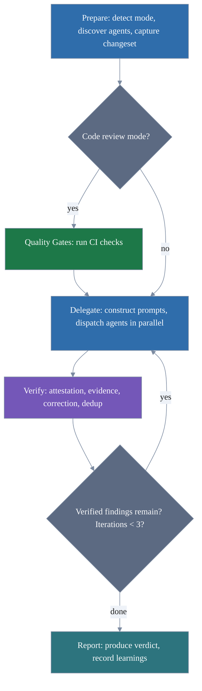

# Review Council - An Unbound Force Project

Instead of one AI reviewer catching what it can, six specialized agents review your code in parallel — security,
architecture, testing, operations, governance, and documentation — then produce a unified verdict.

A multi-persona code and specification review [harness](https://martinfowler.com/articles/harness-engineering.html) for
AI coding tools. Installs as a [Lola](https://github.com/LobsterTrap/lola) module and works with Claude Code, Cursor,
Gemini CLI, and OpenCode.

## Review Council as a Harness

Review Council is a **harness** — the infrastructure around AI agents that guides their behavior and validates their
output. Following [harness engineering principles](https://martinfowler.com/articles/harness-engineering.html), it
combines feedforward and feedback controls to increase the probability of correct initial results and enable
self-correction:

**Guides (feedforward controls)** — anticipatory controls that steer reviewer behavior before action:
- Convention packs defining coding and documentation standards
- Reviewer protocol specifying evidence discipline and output format
- Project governance documents (Constitution extension point)
- Prior learnings from previous review runs (Knowledge tool extension point)

**Sensors (feedback controls)** — observational controls that enable self-correction after action:
- Self-attestation verification against the changeset
- Evidence checking to confirm quoted code exists in cited files
- Correction round for fixable errors (hallucinations, stale evidence)
- Quality gates (CI checks, build/test/lint results)
- Deduplication to strip redundant findings

Both control types operate computationally (deterministic CI checks, evidence verification) and inferentially (semantic
analysis by specialized reviewer agents).

## What It Does

Review Council runs a panel of specialized reviewer agents against your code or specifications:

| Persona           | Focus                                 | Temperature |
|-------------------|---------------------------------------|-------------|
| **The Guard**     | Intent drift, governance, zero-waste  | 0.1         |
| **The Architect** | Structure, patterns, conventions, DRY | 0.1         |
| **The Adversary** | Security, resilience, secrets, CVEs   | 0.1         |
| **The Tester**    | Test quality, coverage, isolation     | 0.1         |
| **The Operator**  | Operations, deployment, dependencies  | 0.1         |
| **The Curator**   | Documentation gaps, content triage    | 0.2         |

Each reviewer agent reviews independently and returns a verdict. The council verifies every finding against actual file
content — stripping fabricated evidence — then produces a unified result: **APPROVE** or **REQUEST CHANGES**.

The `/review-council` command invokes the six reviewer agents automatically. The module also includes three content
production agents that are invoked directly for writing tasks — they share the module's convention packs and extension
points but do not participate in the review council flow:

| Persona        | Focus                                     | Temperature |
|----------------|-------------------------------------------|-------------|
| **The Scribe** | Technical docs, READMEs, API docs         | 0.1         |
| **The Herald** | Blog posts, release notes, announcements  | 0.4         |
| **The Envoy**  | PR/comms, social media, community updates | 0.5         |

## Model Performance

Review Council has been evaluated across Claude model tiers and AI coding tools using a suite of six test cases
covering security flaws (Go), architecture issues (TypeScript/React), multi-concern codebases (Python), false-positive
resistance (clean Go), per-persona coverage (Python), and convention pack detection (TypeScript). Each case has a rubric
with weighted dimensions and a pass threshold.

Results from the latest eval run (30 cells, 6 cases x 5 CLI/model combinations):

| Model | CLI | Avg Score | Cases Passed | Cost/Review |
|-------|-----|-----------|--------------|-------------|
| Sonnet 4 | OpenCode | **0.94** | 6/6 | ~$1.30 |
| Sonnet 4 | Claude Code | 0.90 | 6/6 | ~$2.20 |
| Opus 4 | Claude Code | 0.89 | 6/6 | ~$5.35 |
| Opus 4 | OpenCode | 0.88 | 6/6 | ~$2.50 |
| Haiku 4 | Claude Code | 0.72 | 4/6 | ~$0.34 |

**Sonnet 4 is the recommended model.** It achieves the highest average score across all test cases, passes every case
on both CLIs, and costs roughly half of what Opus does per review. Opus matches Sonnet on detection quality but does not
meaningfully outperform it on any dimension while costing 2-4x more.

Haiku passes the majority of cases but struggles with false-positive suppression on clean codebases and convention pack
attribution. It is suitable for quick scans where cost matters more than precision.

Per-case scores:

| Case | CC/Opus | CC/Sonnet | CC/Haiku | OC/Opus | OC/Sonnet |
|------|---------|-----------|----------|---------|-----------|
| Go security (4 flaws) | 1.00 | 1.00 | 0.85 | 1.00 | 1.00 |
| TS/React architecture (5 flaws) | 0.73 | 0.73 | 0.73 | 0.73 | **1.00** |
| Python multi-concern (7 flaws) | 0.88 | 1.00 | 1.00 | 0.88 | 1.00 |
| Go clean code (0 flaws) | 1.00 | 1.00 | 0.40 | 1.00 | 1.00 |
| Python per-persona (6 flaws) | 1.00 | 0.84 | 0.90 | 0.90 | 0.84 |
| TS convention pack (5 violations) | 0.75 | 0.85 | 0.45 | 0.79 | 0.79 |

The eval harness lives in `.lola-eval/` and uses [promptfoo](https://www.promptfoo.dev/) with custom providers and a
trajectory judge. Run `task lola-eval:test` to reproduce.

## Install

### Via Lola (recommended)

```bash
lola mod add https://github.com/unbound-force/review-council.git
lola install review-council
```

### Manual

Clone and copy the module directory into your project's AI tool configuration:

```bash
git clone https://github.com/unbound-force/review-council.git
# For Claude Code:
cp review-council/module/agents/divisor-*.md .claude/agents/
cp -r review-council/module/skills/review-council/ .claude/skills/review-council/
```

Convention references are required — all reviewer agents depend on `reviewer-protocol.md`. Copy them to your user or project
references directory:

```bash
# User-level (applies to all projects):
mkdir -p "${XDG_CONFIG_HOME:-$HOME/.config}/review-council/packs"
cp review-council/module/references/*.md "${XDG_CONFIG_HOME:-$HOME/.config}/review-council/packs/"

# Or project-level (applies to this repo only):
mkdir -p .review-council/packs
cp review-council/module/references/*.md .review-council/packs/
```

Adjust agent and skill paths for your AI tool (`.cursor/`, `.gemini/`, etc.).

### Optional Dependency: `gh` CLI

The Curator agent can file GitHub issues for documentation gaps when a Docs repo is configured (see Extension Points).
This requires the [GitHub CLI](https://cli.github.com/) (`gh`) to be installed and authenticated (`gh auth login`).
Without `gh`, the Curator reports gaps as review findings instead.

## Quick Start

```
/review-council        # auto-detect mode from workspace state
/review-council code   # force code review mode
/review-council specs  # force spec review mode
```

## How It Works

The `/review-council` command is a re-entrant state machine implemented in `SKILL.md` that orchestrates five phases
using a hybrid of bash scripts (deterministic work) and LLM phase files (judgment work):

| Phase             | Implementation             | Purpose                                  |
|-------------------|----------------------------|------------------------------------------|
| **Prepare**       | `rc-prepare.sh`            | Mode detection, discovery, session setup |
| **Quality Gates** | inline in `SKILL.md`       | CI checks (Code Review only)             |
| **Delegate**      | `phases/delegate.md`       | Prompt construction, dispatch            |
| **Verify**        | `rc-verify-evidence.sh`    | Attestation, evidence, correction, dedup |
| **Report**        | `rc-render-report.sh`      | Final report, learnings feedback         |

Scripts live in `skills/review-council/scripts/`. Phase files live in `skills/review-council/phases/`. Each phase
loads only when reached — the orchestrating LLM never needs to hold the full pipeline in context.

### Pipeline



1. **Prepare** — detect mode, discover agents, set up session cache at `$XDG_CACHE_HOME/review-council/`, capture
   changeset and diff
2. **Quality Gates** — read CI config, run build/test/lint locally (code review only)
3. **Delegate** — construct prompts with changeset, diff, and prior run context; dispatch agents in parallel with model
   tier guidance (capable tier for Adversary/Architect/Guard, standard for others)
4. **Verify** — check self-attestation against changeset, verify evidence quotes exist in cited files, give agents one
   correction round for fixable errors, strip fabricated findings, deduplicate
5. **Iterate** — fix verified findings, re-run delegation+verification (up to 3 iterations)
6. **Report** — produce final verdict, record learnings for future runs

### Session Cache

Each run creates a session directory at `$XDG_CACHE_HOME/review-council/<project>/<timestamp>/` containing:

- `session.txt` — human-readable run metadata
- `tracking.md` — structured phase-by-phase state
- `changeset.txt` — reviewed file list
- `diff.patch` — full patch (code review)
- `verdicts/` — per-agent output and verification log
- `learnings.txt` — false positives and validated patterns

## Convention Packs

Convention packs define coding and documentation standards that reviewer agents check against. The module ships with
these packs:

| Pack                   | Language   | Contents                                        |
|------------------------|------------|-------------------------------------------------|
| `severity.md`          | Any        | Shared severity level definitions               |
| `base.md`              | Any        | Language-agnostic coding conventions (fallback) |
| `go.md`                | Go         | Self-contained Go conventions                   |
| `typescript.md`        | TypeScript | Self-contained TypeScript conventions           |
| `content.md`           | Any        | Content writing standards (content agents only) |
| `reviewer-protocol.md` | Any        | Shared reviewer procedures and output format    |
| `model-guidance.md`    | Any        | Model selection guidance and eval data          |

### Customization

Packs are resolved in priority order (later wins):

1. **Module packs** — shipped with this module (read-only)
2. **User packs** — `$XDG_CONFIG_HOME/review-council/packs/`
3. **Project packs** — `.review-council/packs/` in your repo

To override a shipped pack, create a file with the same name at a higher priority level. To add a new pack, drop a new
`.md` file into either location.

## Extension Points

Configure optional integrations by adding a "Review Council Configuration" section to your project's AGENTS.md or
CLAUDE.md:

```text
## Review Council Configuration

- Constitution: ./GOVERNANCE.md
- Knowledge tool: my_semantic_search
- Docs repo: myorg/docs
- Quality tool: my_quality_reporter
```

| Extension Point | Purpose                              | Default                  |
|-----------------|--------------------------------------|--------------------------|
| Constitution    | Path to project governance document  | Skip constitution checks |
| Knowledge tool  | MCP tool name for semantic search    | Skip prior learnings     |
| Docs repo       | GitHub repo for documentation issues | Report gaps as findings  |
| Quality tool    | Agent name for quality analysis      | Skip quality analysis    |
| Batch size      | Max files per delegation batch       | 20                       |

All extension points are optional. The review council works without any of them — agents gracefully skip checks that
require unconfigured extensions.

## Verification

After installing the module, run these checks to confirm your installation is working:

**1. Agent discovery**

Invoke `/review-council code` in any git repository. You should see the council announce the discovered reviewer agents
by name. If you see "no agents found," check the Troubleshooting section below.

**2. Pack resolution**

Ask any reviewer agent to show which convention pack it loaded. It should reference `reviewer-protocol.md` for its
output format.

**3. UF reference sweep** (for module contributors)

From the repo root, verify no UF-specific references leaked into the module:

```bash
grep -rn \
  --include="*.md" \
  -e "dewey_semantic_search\b" \
  -e "gaze-reporter" \
  -e "muti-mind" \
  review-council/module/
```

Zero matches means the module is clean.

## Troubleshooting

**No agents found**: Verify that `divisor-*-code.md` files are in your AI tool's agents directory (e.g.,
`.claude/agents/` for Claude Code). Run `ls .claude/agents/divisor-*` to confirm. If using a different AI tool, check
its equivalent agents directory.

**`reviewer-protocol.md` missing**: All reviewer agents depend on this pack. Ensure you copied all files from
`module/references/` — not just language-specific packs.

**Curator cannot file issues**: Install and authenticate the `gh` CLI: `gh auth login`. Without authentication, the
Curator reports documentation gaps as findings instead of filing GitHub issues.

## Changes from Unbound Force

Review Council was extracted from the [Unbound Force](https://github.com/unbound-force/unbound-force) monorepo and
restructured as a standalone Lola module. This section documents the differences between the two versions.

### Command structure: monolithic to modular

In Unbound Force, the entire review pipeline lives in a single file (`.opencode/commands/review-council.md`, ~283
lines). The extracted version uses a hybrid architecture: a `SKILL.md` state machine coordinates bash scripts
(`rc-prepare.sh`, `rc-verify-evidence.sh`, `rc-render-report.sh`) for deterministic work and LLM phase files
(`delegate.md`, `verify.md`, `report.md`) for judgment work. Each phase loads only when reached.

### Agent split: one file per mode

Unbound Force uses one agent file per persona (e.g., `divisor-guard.md`) containing both code review and spec review
logic. The extracted version splits each reviewer persona into `-code.md` and `-spec.md` variants, so each agent file
contains only the logic for its review mode. Content agents (Scribe, Herald, Envoy) remain unsplit because they are
invoked directly for writing tasks, not through the review pipeline.

| Unbound Force         | Extracted                                              |
|-----------------------|--------------------------------------------------------|
| `divisor-guard.md`    | `divisor-guard-code.md`, `divisor-guard-spec.md`       |
| `divisor-architect.md`| `divisor-architect-code.md`, `divisor-architect-spec.md`|
| `divisor-adversary.md`| `divisor-adversary-code.md`, `divisor-adversary-spec.md`|
| `divisor-testing.md`  | `divisor-testing-code.md`, `divisor-testing-spec.md`   |
| `divisor-sre.md`      | `divisor-sre-code.md`, `divisor-sre-spec.md`           |
| `divisor-curator.md`  | `divisor-curator-code.md`, `divisor-curator-spec.md`   |
| `divisor-scribe.md`   | `divisor-scribe.md` (unchanged)                        |
| `divisor-herald.md`   | `divisor-herald.md` (unchanged)                        |
| `divisor-envoy.md`    | `divisor-envoy.md` (unchanged)                         |

### Shared procedures extracted to `reviewer-protocol.md`

In Unbound Force, each agent file embeds its own copy of shared procedures — evidence discipline, pack loading rules,
prior learnings queries, output format, and self-attestation requirements. The extracted version moves these into a
single `reviewer-protocol.md` convention pack that all reviewer agents reference, eliminating duplication and making
the protocol easier to update.

### Convention pack changes

**Renamed**: `default.md` → `base.md`. The original name implied it was the primary pack; it is actually a
language-agnostic fallback loaded only when no language-specific pack (e.g., `go.md`) matches.

**Removed**: `-custom.md` companion files (`default-custom.md`, `go-custom.md`, `typescript-custom.md`,
`content-custom.md`). Unbound Force shipped tool-owned packs alongside user-owned `-custom.md` files in the same
directory. The extracted version uses a priority-based override system instead — drop a file with the same name into
`$XDG_CONFIG_HOME/review-council/packs/` (user) or `.review-council/packs/` (project) and it takes precedence over
the shipped pack.

**Added**: `reviewer-protocol.md` (see above).

### UF-specific tool references replaced with extension points

Unbound Force hardcodes references to its own tooling:

- **Gaze** (`gaze-reporter` agent) for quality analysis — replaced by the configurable **Quality tool** extension point
- **Dewey** (`dewey_semantic_search` MCP tool) for prior learnings — replaced by the configurable **Knowledge tool**
  extension point
- **Speckit/OpenSpec** workflow tier detection (`NNN-*` and `opsx/*` branch patterns) — removed entirely

The extracted version defines these as optional extension points in a "Review Council Configuration" section of your
project's AGENTS.md or CLAUDE.md. Unconfigured extensions are skipped gracefully — no tools are assumed.

### Mode detection generalized

Unbound Force mode detection recognizes its project-specific governance frameworks:

- `NNN-*` branches → Speckit workflow (reviews `specs/NNN-<name>/` artifacts)
- `opsx/*` branches → OpenSpec workflow (reviews `openspec/changes/<name>/` artifacts)
- Spec file scope varies by detected workflow tier

The extracted version uses a simpler heuristic: files under `specs/`, `docs/specs/`, `docs/design/`,
`docs/superpowers/`, `design/`, or named `spec.md`, `plan.md`, `tasks.md`, `design.md`, `research.md` are treated as
specification artifacts. Everything else is code. No branch-naming conventions are assumed.

### Superpowers spec directory support (new)

The extracted version adds `docs/superpowers/` as a recognized spec artifact location. This directory is where the
[superpowers](https://github.com/obra/superpowers) brainstorming skill writes design specs
(`docs/superpowers/specs/YYYY-MM-DD-<topic>-design.md`) and where the writing-plans skill stores implementation plans.
Unbound Force did not use this convention — the path is a net-new addition, not a migration from an existing UF path.

Files under `docs/superpowers/` are classified as spec artifacts for auto-detection purposes and included in the scan
locations for Spec Review Mode. All six reviewer agents, the shared `reviewer-protocol.md`, and the prepare phase
recognize this path.

### Directory layout

| Purpose          | Unbound Force                    | Extracted                                                           |
|------------------|----------------------------------|---------------------------------------------------------------------|
| Agents           | `.opencode/agents/`              | `module/agents/`                                                    |
| Entry point      | `.opencode/commands/`            | `module/skills/review-council/SKILL.md`                             |
| Pipeline phases  | (embedded in single command)     | `module/skills/review-council/phases/` + `scripts/`                 |
| Convention refs  | `.opencode/uf/packs/`            | `module/references/`                                                |
| Skills           | `.opencode/skills/` (shared)     | `module/skills/review-council/`                                     |
| Module metadata  | `AGENTS.md` (project-level)      | `module/AGENTS.md` (module-level)                                   |

## License

[Apache 2.0](LICENSE)
