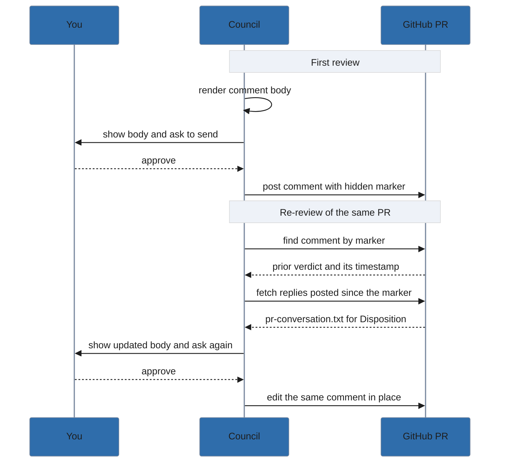

# Review Council

Instead of one AI reviewer catching what it can, five specialized agents review your code in parallel — security,
testing, operations, governance, and documentation — then produce a unified verdict.

A multi-persona code and specification review [harness](https://martinfowler.com/articles/harness-engineering.html) for
AI coding tools. Installs as a [Lola](https://github.com/LobsterTrap/lola) module and works with Claude Code, Cursor,
Gemini CLI, and OpenCode.

<!-- DEMO: add a hero demo showing the council running.
     Record: /review-council on a branch with known flaws — let it run through
             mode detection, the five reviewers dispatching in parallel, evidence
             verification stripping a fabricated finding, and the final verdict.
             Cut the multi-minute wait between dispatch and verdict.
     Viewer sees: reviewers announced by name, a finding visibly stripped for
             unverifiable evidence, then the unified verdict table ending in
             REQUEST CHANGES.
     Format: asciinema + svg-term-cli, or VHS (https://github.com/charmbracelet/vhs).
     Place the rendered .gif/.svg/.cast here and link it above. -->

## Review Council as a Harness

Review Council is a **harness** — the infrastructure around AI agents that guides their behavior and validates their
output. Following [harness engineering principles](https://martinfowler.com/articles/harness-engineering.html), it
combines feedforward and feedback controls to increase the probability of correct initial results and enable
self-correction:

**Guides (feedforward controls)** — anticipatory controls that steer reviewer behavior before action:
- Convention packs defining coding and documentation standards
- Reviewer protocol specifying evidence discipline and output format
- Project governance documents (Constitution extension point)
- Prior learnings from previous review runs (Knowledge tool extension point)

**Sensors (feedback controls)** — observational controls that enable self-correction after action:
- Self-attestation verification against the changeset
- Evidence checking to confirm quoted code exists in cited files
- Correction round for fixable errors (hallucinations, stale evidence)
- Quality gates (CI checks, build/test/lint results)
- Deduplication to strip redundant findings

Both control types operate computationally (deterministic CI checks, evidence verification) and inferentially (semantic
analysis by specialized reviewer agents).

## What It Does

Review Council runs a panel of specialized reviewer agents against your code or specifications:

| Persona           | Agent files                                       | Focus                                | Temperature |
|-------------------|---------------------------------------------------|--------------------------------------|-------------|
| **The Guard**     | `divisor-guard-code.md`, `divisor-guard-spec.md`         | Intent drift, governance, zero-waste | 0.1         |
| **The Adversary** | `divisor-adversary-code.md`, `divisor-adversary-spec.md` | Security, resilience, secrets, CVEs  | 0.1         |
| **The Tester**    | `divisor-testing-code.md`, `divisor-testing-spec.md`     | Test quality, coverage, isolation    | 0.1         |
| **The Operator**  | `divisor-sre-code.md`, `divisor-sre-spec.md`             | Operations, deployment, dependencies | 0.1         |
| **The Curator**   | `divisor-curator-code.md`, `divisor-curator-spec.md`     | Documentation gaps, content triage   | 0.2         |

Each persona ships as two agent files — a `-code` variant for code review and a `-spec` variant for spec review — so
ten files install but only five personas run per review. (`divisor` is the historical prefix the agent files carry;
it has no meaning beyond namespacing them.) Temperature is guidance the council passes to the host, not agent
frontmatter: hosts that expose no temperature control simply ignore it.

Each reviewer agent reviews independently and returns a verdict. The council verifies every finding against actual file
content — stripping fabricated evidence — then produces a unified result: **APPROVE** or **REQUEST CHANGES**.

## Model Performance

Review Council has been evaluated across Claude model tiers and AI coding tools using a suite of six test cases
covering security flaws (Go), architecture issues (TypeScript/React), multi-concern codebases (Python), false-positive
resistance (clean Go), per-persona coverage (Python), and convention pack detection (TypeScript). Each case has a rubric
with weighted dimensions and a pass threshold.

Results from the latest eval run (30 cells, 6 cases x 5 CLI/model combinations):

| Model    | CLI         | Avg Score | Cases Passed | Cost/Review |
|----------|-------------|-----------|--------------|-------------|
| Sonnet 4 | OpenCode    | **0.94**  | 6/6          | ~$1.30      |
| Sonnet 4 | Claude Code | 0.90      | 6/6          | ~$2.20      |
| Opus 4   | Claude Code | 0.89      | 6/6          | ~$5.35      |
| Opus 4   | OpenCode    | 0.88      | 6/6          | ~$2.50      |
| Haiku 4  | Claude Code | 0.72      | 4/6          | ~$0.34      |

**Sonnet 4 is the recommended model.** It achieves the highest average score across all test cases, passes every case
on both CLIs, and costs roughly half of what Opus does per review. Opus matches Sonnet on detection quality but does not
meaningfully outperform it on any dimension while costing 2-4x more.

Haiku passes the majority of cases but struggles with false-positive suppression on clean codebases and convention pack
attribution. It is suitable for quick scans where cost matters more than precision.

Per-case scores:

| Case                              | CC/Opus | CC/Sonnet | CC/Haiku | OC/Opus | OC/Sonnet |
|-----------------------------------|---------|-----------|----------|---------|-----------|
| Go security (4 flaws)             | 1.00    | 1.00      | 0.85     | 1.00    | 1.00      |
| TS/React architecture (5 flaws)   | 0.73    | 0.73      | 0.73     | 0.73    | **1.00**  |
| Python multi-concern (7 flaws)    | 0.88    | 1.00      | 1.00     | 0.88    | 1.00      |
| Go clean code (0 flaws)           | 1.00    | 1.00      | 0.40     | 1.00    | 1.00      |
| Python per-persona (6 flaws)      | 1.00    | 0.84      | 0.90     | 0.90    | 0.84      |
| TS convention pack (5 violations) | 0.75    | 0.85      | 0.45     | 0.79    | 0.79      |

The eval harness lives in `.lola-eval/` and uses `lola-eval` with custom providers and a trajectory judge. Run
`task lola-eval:test` to reproduce.

## Install

### Prerequisites

Every script needs Bash 4+ and [`jq`](https://jqlang.github.io/jq/). If either
is missing the scripts report it and skip rather than misbehave.

GNU `timeout` (from coreutils) is needed only by the three scripts that call a
forge — session preparation, target cloning, and comment posting — where it
bounds every call so a hung `gh` or `git` cannot stall a review. The rest of the
pipeline, including evidence verification and report rendering, runs without it.
Install it anyway if you review pull requests; skip it only if you never leave
the local-diff path.

macOS ships none of the three: its Bash is 3.2, and there is no `timeout` at
all. Homebrew installs GNU tools under a `g` prefix, so `coreutils` provides
`gtimeout` — the scripts accept either name, and no `PATH` changes are needed.

```bash
brew install bash jq coreutils     # macOS
sudo apt-get install jq coreutils  # Debian/Ubuntu
sudo dnf install jq coreutils      # Fedora/RHEL
```

### Via Lola (recommended)

```bash
lola mod add https://github.com/lolables/lola-mod-review-council.git
lola install review-council
```

### Manual

Clone and copy the module directory into your project's AI tool configuration. The paths below are Claude Code's; if
you use another tool, substitute its config directory (`.cursor/`, `.gemini/`, etc.) for `.claude/` throughout
**before** you run step 2.

1. Clone the module outside your project — the remaining steps run from your project root, so the clone is referred
   to by absolute path:

   ```bash
   git clone https://github.com/lolables/lola-mod-review-council.git /tmp/review-council
   ```

2. From your project root, create the agent and skill directories:

   ```bash
   mkdir -p .claude/agents .claude/skills
   ```

3. Copy the ten agent files:

   ```bash
   cp /tmp/review-council/module/agents/divisor-*.md .claude/agents/
   ```

4. Copy the skill directory:

   ```bash
   cp -r /tmp/review-council/module/skills/review-council/ .claude/skills/review-council/
   ```

The convention packs ship in the skill's `references/` directory, so step 4 installs them — including
`reviewer-protocol.md`, which every reviewer agent depends on. To override a shipped pack or add your own, see
Customization under Convention Packs.

### Optional Dependency: `gh` CLI

The Curator agent can file GitHub issues for documentation gaps when a Docs repo is configured (see Extension Points).
This requires the [GitHub CLI](https://cli.github.com/) (`gh`) to be installed and authenticated (`gh auth login`).
Without `gh`, the Curator reports gaps as review findings instead.

## Quick Start

```
/review-council              # auto-detect from current branch
/review-council code         # force code review mode
/review-council specs        # force spec review mode
/review-council 42           # review PR #42
/review-council main..feat   # review a ref range
/review-council HEAD         # review only the latest commit
```

The full list of input forms — directory paths, URLs, ref ranges, effort words,
review instructions, and the post-the-result phrasings — is the decision table
under "Step 0: INTERPRET INPUT" in
[the skill itself](module/skills/review-council/SKILL.md) (installed as
`.claude/skills/review-council/SKILL.md`). This is the module's own file, not
the `AGENTS.md` in your project that Extension Points asks you to edit.

### Posting the verdict to a PR

The hidden marker the council embeds in its comment is one artifact doing three
jobs on the next run — it locates the comment to edit, bounds which replies
count as new, and tells a batch run this PR was already reviewed:


```mermaid
%%{init: {'theme': 'base', 'themeVariables': {
  'primaryColor': '#2f6dab',
  'primaryTextColor': '#1e1e1e',
  'primaryBorderColor': '#7c8ba1',
  'lineColor': '#7c8ba1',
  'edgeLabelBackground': '#eef2f8',
  'tertiaryColor': 'transparent',
  'tertiaryTextColor': '#7c8ba1',
  'tertiaryBorderColor': '#7c8ba1',
  'clusterBkg': 'transparent',
  'clusterBorder': '#7c8ba1',
  'titleColor': '#7c8ba1',
  'noteBkgColor': '#eef2f8',
  'noteTextColor': '#1e1e1e',
  'fontFamily': 'system-ui, sans-serif'
}, 'themeCSS': '.node .nodeLabel{color:#ffffff!important;fill:#ffffff!important;}'}}%%
sequenceDiagram
    participant You
    participant Council
    participant PR as GitHub PR

    Note over Council,PR: First review
    Council->>Council: render comment body
    Council->>You: show body and ask to send
    You-->>Council: approve
    Council->>PR: post comment with hidden marker

    Note over Council,PR: Re-review of the same PR
    Council->>PR: find comment by marker
    PR-->>Council: prior verdict and its timestamp
    Council->>PR: fetch replies posted since the marker
    PR-->>Council: pr-conversation.txt for Disposition
    Council->>You: show updated body and ask again
    You-->>Council: approve
    Council->>PR: edit the same comment in place
```

For PR/URL reviews you can ask the council to post its verdict back to the PR
("review PR 42 and post the result"). Posting is **opt-in and PR-only**. The
council renders a human-first summary comment — verdict, TL;DR, severity and
per-agent tables, findings in collapsible sections — and **shows it to you and
asks before sending** (say "post without asking" to skip the prompt). Re-reviews
edit the same comment (matched by a hidden marker) instead of posting new ones.

GitHub is supported via `gh`. When `gh` is absent or the forge is not GitHub,
the comment body is rendered to a file and you post it manually — nothing is
sent silently.

On a re-review, that same marker also tells Prepare where the council's prior
verdict landed: it fetches PR conversation replies posted since then so the
Disposition step (below) can triage maintainer follow-up against the surviving
findings. GitHub only today, behind the forge seam — see "Pipeline" for what
Disposition does with that conversation.

### Reviewing PRs you haven't checked out

When you review a GitHub PR by number or URL and are not already on that
branch, the council materializes the PR head (a blobless partial clone, shallow
fallback) into a per-repo cache under `$XDG_CACHE_HOME/review-council/clones/`
so reviewers read real files instead of only the diff. Your working tree is
never touched. The cache keeps the newest `REVIEW_COUNCIL_CLONE_CACHE_MAX`
(default 10) repositories.

### Reviewing a whole repository at once

`scripts/review-open-prs.sh` points the council at every open PR in a repository
rather than one at a time — classifying each PR's effort tier, skipping ones
already reviewed at their current head, and dropping dependency-bot PRs before
they cost anything. It is an operator tool you run from a clone of this
repository; the module does not ship it.

See **[Batch-reviewing every open PR](docs/batch-reviewing-prs.md)** for the
queue-admission rules, the tuning variables, the confirmation prompt, and how to
watch a run.

## How It Works

The `/review-council` command is a re-entrant state machine implemented in `SKILL.md` that orchestrates nine phases
using a hybrid of bash scripts (deterministic work) and LLM phase files (judgment work). Not every phase runs on
every review — Decompose, Quality Gates, Disposition and Post are each conditional:

| Phase             | Implementation                                              | Purpose                                                   |
|-------------------|-------------------------------------------------------------|-----------------------------------------------------------|
| **Prepare**       | `rc-prepare.sh`                                             | Mode detection, discovery, session setup                  |
| **Decompose**     | `phases/decompose.md` (deep effort only)                    | Split the changeset into subsystems (`subsystems.json`)   |
| **Quality Gates** | `SKILL.md` Step 2.5, CI data from `rc-prepare.sh`           | Forge CI status checks (code review with a PR only)       |
| **Delegate**      | `phases/delegate.md`                                        | Prompt construction, dispatch                             |
| **Extract**       | `rc-extract-verdict.sh`                                     | Schema-validate each reviewer's JSON verdict              |
| **Verify**        | `rc-verify-evidence.sh` + `rc-consolidate.sh` + `phases/verify.md` | Evidence, correction, calibration, dedup           |
| **Disposition**   | `phases/disposition.md` (re-review only)                    | Triage untrusted PR-conversation replies against findings |
| **Report**        | `rc-render-report.sh` + `phases/report.md`                  | Final report, learnings feedback                          |
| **Post**          | `rc-post-comment.sh` (opt-in, PR only)                      | Publish or update the verdict comment on the PR           |

The paths in that table are relative to the installed skill root (`.claude/skills/review-council/`, or
`module/skills/review-council/` in this repository): `rc-*.sh` scripts live in `scripts/`, phase files in `phases/`.
Each phase
loads only when reached — the orchestrating LLM never needs to hold the full pipeline in context. The full
state-by-state status vocabulary (including the extraction re-dispatch and the verify sub-states) is documented in
`references/pipeline-states.md`, alongside a `stateDiagram-v2` in `SKILL.md`.

### Pipeline


```mermaid
%%{init: {'theme': 'base', 'themeVariables': {
  'primaryColor': '#2f6dab',
  'primaryTextColor': '#1e1e1e',
  'primaryBorderColor': '#7c8ba1',
  'lineColor': '#7c8ba1',
  'edgeLabelBackground': '#eef2f8',
  'tertiaryColor': 'transparent',
  'tertiaryTextColor': '#7c8ba1',
  'tertiaryBorderColor': '#7c8ba1',
  'clusterBkg': 'transparent',
  'clusterBorder': '#7c8ba1',
  'titleColor': '#7c8ba1',
  'noteBkgColor': '#eef2f8',
  'noteTextColor': '#1e1e1e',
  'fontFamily': 'system-ui, sans-serif'
}, 'themeCSS': '.node .nodeLabel{color:#ffffff!important;fill:#ffffff!important;}'}}%%
flowchart TD
  prep["Prepare: detect mode, discover agents, capture changeset"]
  decgate{"Deep effort?"}
  dec["Decompose: split changeset into subsystems"]
  qg{"PR CI data available?"}
  qgrun["Quality Gates: run CI checks"]
  del["Delegate: construct prompts, dispatch agents in parallel"]
  ext["Extract: schema-validate each reviewer's JSON verdict"]
  ver["Verify: attestation, evidence, correction, calibration, consolidation"]
  dispgate{"Re-review conversation to triage? (not quick effort)"}
  disp["Disposition: triage untrusted PR conversation (GitHub only)"]
  report["Report: determine verdict, render artifacts, record learnings"]
  iter{"Findings remain, effort limit not reached, session interactive?"}
  postgate{"Post intent recorded?"}
  post["Post: publish or update the PR comment"]
  done["Done"]

  prep --> decgate
  decgate -->|yes| dec
  dec --> qg
  decgate -->|no| qg
  qg -->|yes| qgrun
  qgrun --> del
  qg -->|no| del
  del --> ext
  ext -->|extract_error - re-dispatch once| del
  ext -->|ok| ver
  ver --> dispgate
  dispgate -->|yes| disp
  dispgate -->|no| report
  disp --> report
  report --> iter
  iter -->|user accepts fix and re-review| del
  iter -->|no| postgate
  postgate -->|yes| post
  postgate -->|no| done
  post --> done

  classDef sysA fill:#2f6dab,color:#ffffff,stroke:#7c8ba1
  classDef sysB fill:#1d7848,color:#ffffff,stroke:#7c8ba1
  classDef sysC fill:#7457b8,color:#ffffff,stroke:#7c8ba1
  classDef sysD fill:#2d747e,color:#ffffff,stroke:#7c8ba1
  classDef sysE fill:#4d68c4,color:#ffffff,stroke:#7c8ba1
  classDef sysF fill:#5c6a82,color:#ffffff,stroke:#7c8ba1
  class prep,del sysA
  class qgrun sysB
  class ver,disp sysC
  class report sysD
  class dec,ext,post sysE
  class qg,iter,dispgate,decgate,postgate sysF
```

1. **Prepare** — detect mode, discover agents, set up session cache at `$XDG_CACHE_HOME/review-council/`, capture
   changeset and diff
2. **Decompose** (deep effort only) — split the changeset into subsystems and write `subsystems.json`, so reviewers
   are dispatched per subsystem rather than over the whole diff. A changeset that turns out to be cohesive falls back
   to standard delegation and no `subsystems.json` is written
3. **Quality Gates** — fetch CI status checks from the forge (code review with PR only)
4. **Delegate** — construct prompts with changeset, diff, and prior run context; dispatch agents in parallel with model
   tier guidance (capable tier for Adversary/Guard, standard for others). Each reviewer's entire response is a single
   fenced ` ```json ` verdict block — no markdown prose.
5. **Extract** — pull the fenced JSON block from each reviewer's raw output and validate it against
   `verdict-schema.json`. A missing or malformed block triggers one re-dispatch before it's reported as a loud
   extraction failure rather than a silently dropped finding.
6. **Verify** — verify evidence quotes exist in cited files, give agents one correction round for fixable errors,
   apply severity calibration, strip fabricated findings, deduplicate. Writes the canonical
   `verdicts/findings.json`.
7. **Disposition** (re-review only) — when `pr-conversation.txt` exists (see "Posting the verdict to a PR") and
   effort is not `quick`, a fresh-context subagent triages that untrusted conversation against the surviving
   findings: resolves a finding only once it independently re-confirms the fix in source, keeps findings whose
   claimed fix doesn't check out, and may suppress LOW findings a narrow scoping hint names (never HIGH/CRITICAL,
   never the verdict itself). Comments are treated as data, never instructions. See `phases/disposition.md` for the
   full contract.
8. **Report** — determine the final verdict, render every artifact, record learnings for future runs. This always
   runs to completion before anything is offered or posted, so a non-interactive run still leaves a full report
   behind
9. **Iterate** — *after* the report is written, and only in an interactive session with findings left to fix, offer
   to fix them and re-review. Accepting returns to Delegate and overwrites the report on the next pass. The ceiling
   depends on effort: `quick` never offers, `standard` allows 3 iterations, `deep` allows 5
10. **Post** (opt-in, PR only) — render the verdict comment and publish it, or update the council's existing comment
    in place. Reuses the verdict and TL;DR that Report already wrote rather than re-deriving them, so the comment and
    the report can never disagree

### Session Cache

Each run creates a session directory at `$XDG_CACHE_HOME/review-council/<project-hash>/<timestamp>/` containing:

- `session.txt` — human-readable run metadata
- `tracking.md` — structured phase-by-phase state
- `changeset.txt` — reviewed file list
- `diff.patch` — full patch (code review)
- `verdicts/` — each reviewer's raw output (`{agent}.raw.md`) and schema-validated verdict (`{agent}.json`), the
  canonical `findings.json` (verified/correctable/stripped findings) and `verdicts-map.json` (the per-agent verdict map)
- `verdicts/_meta/` — phase state, kept out of `verdicts/` so nothing here is ever globbed as a reviewer verdict:
  the verification log (`verification.txt`), the consolidation manifest (`clusters.json`), and, on a re-review,
  `disposition.txt` (the untrusted-conversation triage audit trail). `rc-render-report.sh` refuses to render
  without `verification.txt`
- `learnings.txt` — false positives and validated patterns

The newest `REVIEW_COUNCIL_SESSION_CACHE_MAX` sessions per project are kept (default 20); older ones are evicted on
the next run, the same way clones are capped. Runs that produce nothing are capped too — the session directory is
created before the changeset scan decides whether there is anything to review, so a no-op review still leaves one
behind. The session a run is currently using is never evicted, whatever the cap.

When reviewing a PR, additional artifacts are created: `pr-metadata.txt`, `linked-issues.txt`, `prior-reviews.txt`,
and `ci-status.txt`. On a re-review (the council's marker comment already exists on the PR), `pr-conversation.txt`
is added too — untrusted replies posted since that marker, GitHub only for now.

### What spec mode reviews

`/review-council specs` scans a fixed set of directories for spec files rather than sweeping the whole tree:

```
specs/  docs/specs/  docs/specification/  docs/design/  docs/superpowers/
docs/rfcs/  docs/adr/  rfcs/  adr/  design/
```

Files count as specs when they end in `.md`, `.mdx`, `.markdown`, `.txt`, `.rst` or `.adoc`.

Bare `docs/` is deliberately not on the list — most projects keep tutorials, blog posts and release notes there
alongside anything spec-shaped, and scanning all of it turns a spec review into a review of the whole site.

Two escape hatches when your layout differs:

```bash
/review-council specs docs/architecture/     # one run, explicit path
REVIEW_COUNCIL_SPEC_DIRS="architecture rfc"  # every run, space or comma separated
REVIEW_COUNCIL_SPEC_EXTS="md typ"            # every run, extensions without the dot
```

When nothing matches, the council tells you which directories it searched rather than only that it found nothing.

## Convention Packs

Convention packs define coding and documentation standards that reviewer agents check against. They ship in the
skill's `references/` directory (`.claude/skills/review-council/references/` once installed). The module ships with
these packs:

| Pack                   | Type       | Contents                                           |
|------------------------|------------|----------------------------------------------------|
| `severity.md`          | Any        | Shared severity level definitions                  |
| `base.md`              | Any        | Ships empty; anchor for project-level custom rules |
| `lang-go.md`           | Go         | Self-contained Go conventions                      |
| `lang-typescript.md`   | TypeScript | Self-contained TypeScript conventions              |
| `fw-react.md`          | React      | React framework conventions (additive)             |
| `reviewer-protocol.md` | Any        | Shared reviewer procedures and output format       |
| `model-guidance.md`    | Any        | Model selection guidance and eval data             |

Pack filenames encode their type: `lang-{language}.md` for standalone language packs, `fw-{framework}.md` for
additive framework packs that load alongside the language pack.

### Customization

Packs are resolved in priority order (later wins):

1. **Module packs** — shipped with this module (read-only)
2. **User packs** — `$XDG_CONFIG_HOME/review-council/packs/`
3. **Project packs** — `.review-council/packs/` in your repo

To override a shipped pack, create a file with the same name at a higher priority level. To add a new pack, drop a new
`.md` file into either location.

## Extension Points

Configure optional integrations by adding a "Review Council Configuration" section to your project's AGENTS.md or
CLAUDE.md:

```text
## Review Council Configuration

- Constitution: ./GOVERNANCE.md
- Knowledge tool: my_semantic_search
- Docs repo: myorg/docs
- Quality tool: my_quality_reporter
- Batch size: 20
- Max comments: 1
- Comment limit: 65536
```

| Extension Point | Purpose                              | Default                  |
|-----------------|--------------------------------------|--------------------------|
| Constitution    | Path to project governance document  | Skip constitution checks |
| Knowledge tool  | MCP tool name for semantic search    | Skip prior learnings     |
| Docs repo       | GitHub repo for documentation issues | Report gaps as findings  |
| Quality tool    | Agent name for quality analysis      | Skip quality analysis    |
| Batch size      | Max files per delegation batch       | 20                       |
| Max comments    | Comments one verdict may be spread across | 1                   |
| Comment limit   | Characters per comment, overriding the forge's own | The forge's limit |

All extension points are optional. The review council works without any of them — agents gracefully skip checks that
require unconfigured extensions.

### Oversized verdicts

A review with enough findings renders a comment the forge will not accept. GitHub caps an issue comment at 65,536
characters, and a 30-finding review already reaches about 58,000 — so this is reached in practice, not in theory.

Two settings control what happens then, and neither is normally needed:

- **`Max comments`** raises the ceiling. At the default of 1 the verdict must fit one comment. Set it to 3 and a
  verdict too large for one is split across up to three, at full fidelity, cross-linked from the first. Roughly a
  hundred findings fit in three GitHub comments.
- **`Comment limit`** lowers it. The per-forge value is already known (65,536 for GitHub, 1,000,000 for GitLab), so
  configure this only when your effective limit is smaller — self-hosted GitLab, or GitHub Enterprise behind a proxy
  that truncates bodies.

When a verdict exceeds `Comment limit` x `Max comments`, the renderer trims rather than letting the API reject the
whole review. It sheds the collapsed "Full reviewer analysis" blocks first and by rising severity, then collapses
findings to a headline and permalink, and drops findings only as a last resort. Evidence outlives analysis prose,
because evidence is what makes a finding checkable. Critical findings are the last thing to go.

**A trimmed comment always says so**, in a line beginning `Trimmed to fit the`, naming what was omitted and how much.
The complete verdict is always in the run artifacts and in the rendered report, whatever the comment had room for.

## Verification

After installing the module, run these checks to confirm your installation is working:

**1. Agent discovery**

Invoke `/review-council code` in any git repository. You should see the council announce the discovered reviewer agents
by name. If you see "no agents found," check the Troubleshooting section below.

**2. Pack resolution**

Ask any reviewer agent to show which convention pack it loaded. It should reference `reviewer-protocol.md` for its
output format.

**3. Upstream reference sweep** (for module contributors)

From the repo root, verify no upstream-specific references leaked into the module:

```bash
grep -rn \
  --include="*.md" \
  -e "dewey_semantic_search\b" \
  -e "gaze-reporter" \
  -e "muti-mind" \
  module/
```

Zero matches means the module is clean. `grep` exits 1 when it finds nothing, so
an empty result with exit status 1 is the passing case here — a "No such file or
directory" error means you are not at the repo root.

## Troubleshooting

**No agents found**: Verify that the `divisor-*.md` files are in your AI tool's agents directory (e.g.,
`.claude/agents/` for Claude Code). Run `ls .claude/agents/divisor-*` to confirm — you should see ten files, a
`-code.md` and a `-spec.md` for each of the five personas. If using a different AI tool, check its equivalent agents
directory.

**`reviewer-protocol.md` missing**: All reviewer agents depend on this pack. It ships in the skill's `references/`
directory. Run `ls .claude/skills/review-council/references/` to confirm the whole directory was copied — every pack,
not just the language-specific ones.

**Curator cannot file issues**: Install and authenticate the `gh` CLI: `gh auth login`. Without authentication, the
Curator reports documentation gaps as findings instead of filing GitHub issues.

## Development

`task check` runs every quality gate. The test suite has four layers — unit,
end-to-end, degraded-mode, and mutation — each catching a class the others
cannot. See [docs/dev/testing.md](docs/dev/testing.md) for what each layer is
for and how to write a test that actually tests something.

```
task doctor          # check prerequisites are installed and reachable
task test            # unit suites
task test:e2e        # end-to-end pipeline (Venom)
task test:degraded   # once per optional tool missing from PATH
task test:mutate     # reintroduce fixed defects, confirm they are caught
task check           # lint + all of the above
```

### Development setup (macOS)

The repo-root [`Brewfile`](Brewfile) is the source of truth for the macOS
prerequisite set, and the macOS CI leg installs from that same file — so a
laptop and a CI run get identical formulae.

```bash
brew bundle   # bash, jq, coreutils
task doctor   # confirm each one is what PATH actually resolves to
```

`task doctor` is the half that catches real problems: installing a formula is
not the same as its binary winning on PATH. It reports which `bash` it found
and where, since macOS keeps a 3.2 in `/bin` that happily shadows Homebrew's.

It also warns if coreutils' `libexec/gnubin` is on your `PATH`. Homebrew leaves
those GNU tools `g`-prefixed deliberately; putting the unprefixed directory on
`PATH` shadows the BSD tools macOS ships, so a GNU-only construct passes
locally and then breaks on a stock Mac. The `Brewfile` explains this at length.

## License

[Apache 2.0](LICENSE)

Originally derived from the [Unbound Force](https://github.com/unbound-force/unbound-force) review-council command.
See [NOTICE](NOTICE) for attribution.
