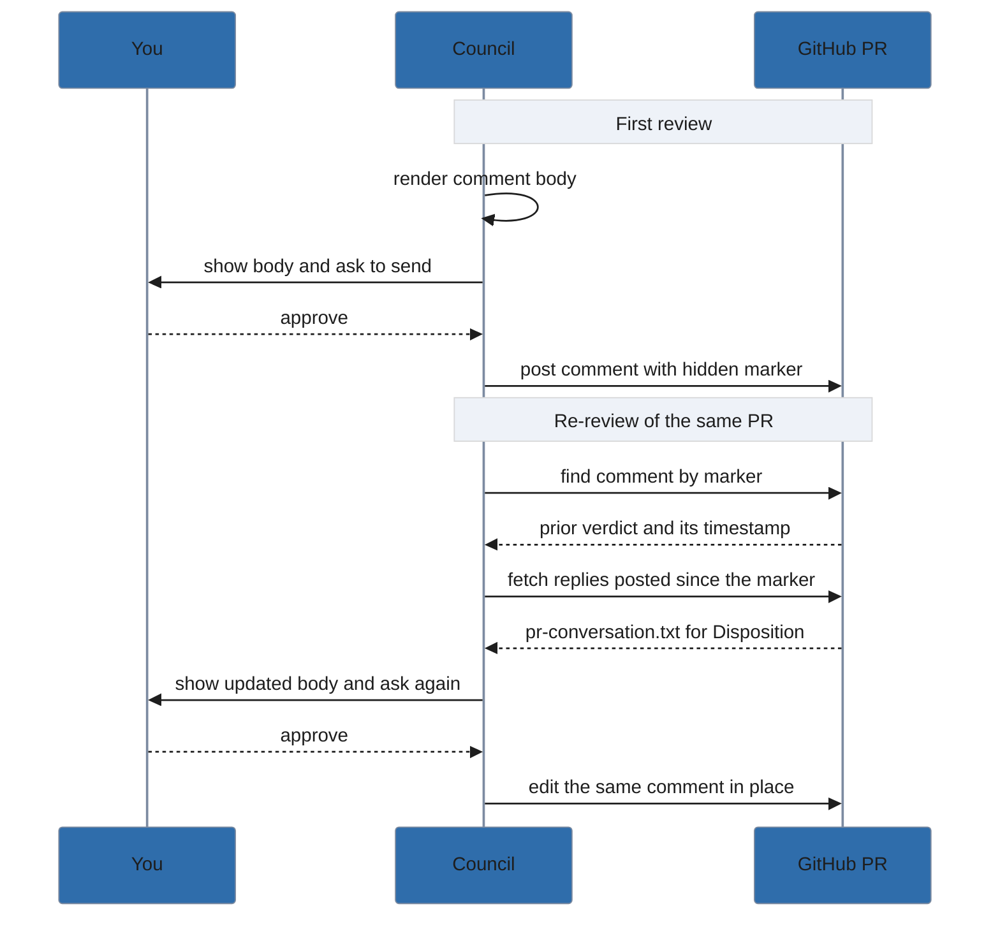
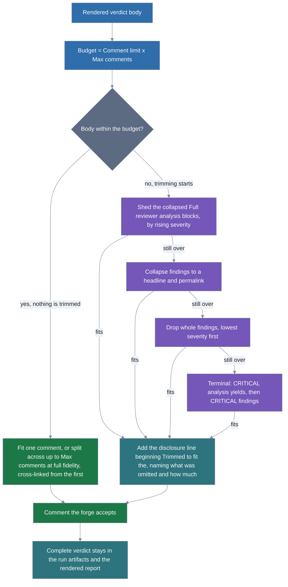

# Review Council

Instead of one AI reviewer catching what it can, five specialized agents review your code in parallel — security,
testing, operations, governance, and documentation — then produce a unified verdict.

A multi-persona code and specification review [harness](https://martinfowler.com/articles/harness-engineering.html) for
AI coding tools. Installs as a [Lola](https://github.com/LobsterTrap/lola) module and works with Claude Code, Cursor,
Gemini CLI, and OpenCode.

<!-- DEMO: add a hero demo showing the council running.
     Record: /review-council on a branch with known flaws — let it run through
             mode detection, the five reviewers dispatching in parallel, evidence
             verification stripping a fabricated finding, and the final verdict.
             Cut the multi-minute wait between dispatch and verdict.
     Viewer sees: reviewers announced by name, a finding visibly stripped for
             unverifiable evidence, then the unified verdict table ending in
             REQUEST CHANGES.
     Format: asciinema + svg-term-cli, or VHS (https://github.com/charmbracelet/vhs).
     Place the rendered .gif/.svg/.cast here and link it above. -->

## Review Council as a Harness

Review Council is a **harness** — the infrastructure around AI agents that guides their behavior and validates their
output. Following [harness engineering principles](https://martinfowler.com/articles/harness-engineering.html), it
combines feedforward and feedback controls to increase the probability of correct initial results and enable
self-correction:

**Guides (feedforward controls)** — anticipatory controls that steer reviewer behavior before action:
- Convention packs defining coding and documentation standards
- Reviewer protocol specifying evidence discipline and output format
- Project governance documents (Constitution extension point)
- Prior learnings from previous review runs (Knowledge tool extension point)

**Sensors (feedback controls)** — observational controls that enable self-correction after action:
- Self-attestation verification against the changeset
- Evidence checking to confirm quoted code exists in cited files
- Correction round for fixable errors (hallucinations, stale evidence)
- Quality gates (CI checks, build/test/lint results)
- Deduplication to strip redundant findings

Both control types operate computationally (deterministic CI checks, evidence verification) and inferentially (semantic
analysis by specialized reviewer agents).

## What It Does

Review Council runs a panel of specialized reviewer agents against your code or specifications:

| Persona           | Agent files                                       | Focus                                | Temperature |
|-------------------|---------------------------------------------------|--------------------------------------|-------------|
| **The Guard**     | `divisor-guard-code.md`, `divisor-guard-spec.md`         | Intent drift, governance, zero-waste | 0.1         |
| **The Adversary** | `divisor-adversary-code.md`, `divisor-adversary-spec.md` | Security, resilience, secrets, CVEs  | 0.1         |
| **The Tester**    | `divisor-testing-code.md`, `divisor-testing-spec.md`     | Test quality, coverage, isolation    | 0.1         |
| **The Operator**  | `divisor-sre-code.md`, `divisor-sre-spec.md`             | Operations, deployment, dependencies | 0.1         |
| **The Curator**   | `divisor-curator-code.md`, `divisor-curator-spec.md`     | Documentation gaps, content triage   | 0.2         |

Each persona ships as two agent files — a `-code` variant for code review and a `-spec` variant for spec review — so
ten files install but only five personas run per review. (`divisor` is the historical prefix the agent files carry;
it has no meaning beyond namespacing them.) Temperature is guidance the council passes to the host, not agent
frontmatter: hosts that expose no temperature control simply ignore it.

Each reviewer agent reviews independently and returns a verdict. The council verifies every finding against actual file
content — stripping fabricated evidence — then produces a unified result: **APPROVE** or **REQUEST CHANGES**.

## Model Performance

Review Council has been evaluated across Claude model tiers and AI coding tools using a suite of six test cases
covering security flaws (Go), architecture issues (TypeScript/React), multi-concern codebases (Python), false-positive
resistance (clean Go), per-persona coverage (Python), and convention pack detection (TypeScript). Each case has a rubric
with weighted dimensions and a pass threshold.

**The numbers below come from the last run of the full two-CLI matrix** — 30
cells, 6 cases x 5 CLI/model combinations — and the same data, averaged across
the two CLIs, is what `references/model-guidance.md` ships (last updated
2026-06-30). `.lola-eval/config.yaml` now pins a **single cell**,
`claude-code` + `claude-sonnet-4-6`: the `opencode` leg is commented out, as
are the Opus and Haiku rows.

Two caveats on reading the table:

- **The Sonnet rows still describe the model that runs today.** Every scored
  row in `.lola-eval/ledger.jsonl` was measured on `claude-sonnet-4-6`, and its
  recorded cost per review — $2.15 on Claude Code, $1.41 on OpenCode — matches
  the Cost/Review column below. What no longer runs on each pass is the
  OpenCode leg, not the model.
- **The Opus rows have no local provenance.** `ledger.jsonl` contains no Opus
  rows at all, so those two lines cannot be reproduced from anything in this
  repository. Treat them as unverified until someone re-measures.

Model names are given as **classes** — the values `REVIEW_COUNCIL_MODEL_CLASS`
accepts — not as specific model versions.

Averages across all six cases, per CLI/model cell:

| Model class | CLI         | Avg Score | Cases Passed | Cost/Review |
|-------------|-------------|-----------|--------------|-------------|
| Sonnet      | OpenCode    | **0.94**  | 6/6          | ~$1.30      |
| Sonnet      | Claude Code | 0.90      | 6/6          | ~$2.20      |
| Opus        | Claude Code | 0.89      | 6/6          | ~$5.35      |
| Opus        | OpenCode    | 0.88      | 6/6          | ~$2.50      |
| Haiku       | Claude Code | 0.72      | 4/6          | ~$0.34      |

**Sonnet-class is the recommended model.** It achieves the highest average score across all test cases, passes every
case on both CLIs, and costs roughly half of what Opus does per review. Opus matches Sonnet on detection quality but
does not meaningfully outperform it on any dimension while costing 2-4x more.

Haiku passes the majority of cases but struggles with false-positive suppression on clean codebases and convention pack
attribution. It is suitable for quick scans where cost matters more than precision.

Per-case scores, **one column per CLI/model cell** — `CC` is Claude Code, `OC` is OpenCode. The per-case table in
`references/model-guidance.md` reports the same run **averaged across both CLIs**, so its figures are the row-wise
means of the pairs below, not different measurements:

| Case                              | CC/Opus | CC/Sonnet | CC/Haiku | OC/Opus | OC/Sonnet |
|-----------------------------------|---------|-----------|----------|---------|-----------|
| Go security (4 flaws)             | 1.00    | 1.00      | 0.85     | 1.00    | 1.00      |
| TS/React architecture (5 flaws)   | 0.73    | 0.73      | 0.73     | 0.73    | **1.00**  |
| Python multi-concern (7 flaws)    | 0.88    | 1.00      | 1.00     | 0.88    | 1.00      |
| Go clean code (0 flaws)           | 1.00    | 1.00      | 0.40     | 1.00    | 1.00      |
| Python per-persona (6 flaws)      | 1.00    | 0.84      | 0.90     | 0.90    | 0.84      |
| TS convention pack (5 violations) | 0.75    | 0.85      | 0.45     | 0.79    | 0.79      |

The eval harness lives in `.lola-eval/` and uses `lola-eval` with custom providers and a trajectory judge. Run
`task lola-eval:test` to reproduce — it installs the harness into `.venv` on first use, which needs
[`uv`](https://docs.astral.sh/uv/). Reproducing the scores also needs `promptfoo` and `bubblewrap`; see AGENTS.md.

## Install

### Prerequisites

Throughout this README, **forge** means the code-hosting platform a repository
lives on — GitHub or GitLab. Anything described as going "through the forge" is
a `gh` or `git` call to that platform, not something the council does locally.

**1. Bash 4+ and [`jq`](https://jqlang.github.io/jq/) — always.**

Every script needs both. If either is missing the scripts report it and skip
rather than misbehave.

**2. GNU `timeout`, from coreutils — if you review pull requests.**

Only the three scripts that call a forge use it — session preparation, target
cloning and comment posting — where it bounds every call so a hung `gh` or
`git` cannot stall a review. The rest of the pipeline, evidence verification
and report rendering included, runs without it. Skip it only if you never
leave the local-diff path.

**3. On macOS, expect all three to be missing.**

Its Bash is 3.2, and it has no `timeout` at all. Homebrew installs GNU tools
under a `g` prefix, so `coreutils` provides `gtimeout` — the scripts accept
either name, and no `PATH` changes are needed.

```bash
brew install bash jq coreutils uv  # macOS
sudo apt-get install jq coreutils  # Debian/Ubuntu
sudo dnf install jq coreutils      # Fedora/RHEL
```

**4. The `lola` CLI — for the recommended install path only.**

`lola mod add` and `lola install` below are that tool. It is not packaged with
this module; install it from [the lola project](https://github.com/LobsterTrap/lola).
The manual install path needs nothing but `git` and `cp`.

**5. [`uv`](https://docs.astral.sh/uv/) — only to reproduce the eval scores.**

No part of a review touches it. It appears in the macOS line above because
`task lola-eval:*` builds the eval harness's virtualenv with it, and keeping
one list means a laptop and the CI leg install the same set. Installing the
module through lola, skip it. On Linux there is no distribution package:

```bash
curl -LsSf https://astral.sh/uv/install.sh | sh
```

**6. [`task`](https://taskfile.dev) — only if you clone this repository.**

Every check, test and eval target in this repo runs through it (`task check`,
`task test`, `task lola-eval:test`). Users installing the module never need it.
Install it per [the go-task instructions](https://taskfile.dev/installation/).

### Via Lola (recommended)

```bash
lola mod add https://github.com/lolables/lola-mod-review-council.git
lola install review-council
```

### Manual

Clone and copy the module directory into your project's AI tool configuration. The paths below are Claude Code's; if
you use another tool, substitute its config directory (`.cursor/`, `.gemini/`, etc.) for `.claude/` throughout
**before** you run step 2.

1. Clone the module outside your project — the remaining steps run from your project root, so the clone is referred
   to by absolute path:

   ```bash
   git clone https://github.com/lolables/lola-mod-review-council.git /tmp/review-council
   ```

2. From your project root, create the agent and skill directories:

   ```bash
   mkdir -p .claude/agents .claude/skills
   ```

3. Copy the ten agent files:

   ```bash
   cp /tmp/review-council/module/agents/divisor-*.md .claude/agents/
   ```

4. Copy the skill directory:

   ```bash
   cp -r /tmp/review-council/module/skills/review-council/ .claude/skills/review-council/
   ```

5. Optional — copy the maintainer diagnostic skill. `review-council-debug`
   exercises the review-council scripts against the current repository and
   judges whether their output is clear enough for an orchestrator to act on.
   Nothing in a review calls it; skip it unless you are debugging the module
   itself:

   ```bash
   cp -r /tmp/review-council/module/skills/review-council-debug/ .claude/skills/review-council-debug/
   ```

The convention packs ship in the skill's `references/` directory, so step 4 installs them — including
`reviewer-protocol.md`, which every reviewer agent depends on. To override a shipped pack or add your own, see
Customization under Convention Packs.

### Optional Dependency: `gh` CLI

The Curator agent can file GitHub issues for documentation gaps when a Docs repo is configured (see Extension Points).
This requires the [GitHub CLI](https://cli.github.com/) (`gh`) to be installed and authenticated (`gh auth login`).
Without `gh`, the Curator reports gaps as review findings instead.

## Quick Start

```
/review-council              # auto-detect from current branch
/review-council code         # force code review mode
/review-council specs        # force spec review mode
/review-council 42           # review PR #42
/review-council main..feat   # review a ref range
/review-council HEAD         # review only the latest commit
/review-council src/auth.go  # review named files, tracked or not
/review-council deep 42      # review PR #42 at the deep effort tier
```

Naming a file reviews that file whatever git makes of it — untracked, ignored,
or committed and unmodified. Naming a directory keeps its other meaning: it
filters the changeset to what changed under it, rather than sweeping the tree.

### Effort tiers

An **effort tier** sets how much work a review is allowed to do. Say the word
anywhere in the command; leave it out and you get `standard`.

| Tier       | What it does                                                                        |
|------------|-------------------------------------------------------------------------------------|
| `quick`    | One pass over the whole changeset. Skips the correction round, severity calibration, consolidation and the narrative; never offers to iterate |
| `standard` | The default. Full verification and report; up to 3 fix-and-re-review iterations      |
| `deep`     | Splits the changeset into subsystems and dispatches reviewers per subsystem, after pricing the fan-out; up to 5 iterations |

Deep is the only tier that runs Decompose, Subsystem Triage and the Cost
Estimate. What each of those does is in [the pipeline
reference](docs/dev/pipeline.md).

The full list of input forms — directory paths, URLs, ref ranges, effort words,
review instructions, and the post-the-result phrasings — is the decision table
under "Step 0: INTERPRET INPUT" in
[the skill itself](module/skills/review-council/SKILL.md) (installed as
`.claude/skills/review-council/SKILL.md`). This is the module's own file, not
the `AGENTS.md` in your project that Extension Points asks you to edit.

### Posting the verdict to a PR

The hidden marker the council embeds in its comment is one artifact doing three
jobs on the next run — it locates the comment to edit, bounds which replies
count as new, and tells a batch run this PR was already reviewed:


```mermaid
%%{init: {'theme': 'base', 'themeVariables': {
  'primaryColor': '#2f6dab',
  'primaryTextColor': '#1e1e1e',
  'primaryBorderColor': '#7c8ba1',
  'lineColor': '#7c8ba1',
  'edgeLabelBackground': '#eef2f8',
  'tertiaryColor': 'transparent',
  'tertiaryTextColor': '#7c8ba1',
  'tertiaryBorderColor': '#7c8ba1',
  'clusterBkg': 'transparent',
  'clusterBorder': '#7c8ba1',
  'titleColor': '#7c8ba1',
  'noteBkgColor': '#eef2f8',
  'noteTextColor': '#1e1e1e',
  'fontFamily': 'system-ui, sans-serif'
}, 'themeCSS': '.node .nodeLabel{color:#ffffff!important;fill:#ffffff!important;}'}}%%
sequenceDiagram
    participant You
    participant Council
    participant PR as GitHub PR

    Note over Council,PR: First review
    Council->>Council: render comment body
    Council->>You: show body and ask to send
    You-->>Council: approve
    Council->>PR: post comment with hidden marker

    Note over Council,PR: Re-review of the same PR
    Council->>PR: find comment by marker
    PR-->>Council: prior verdict and its timestamp
    Council->>PR: fetch replies posted since the marker
    PR-->>Council: pr-conversation.txt for Disposition
    Council->>You: show updated body and ask again
    You-->>Council: approve
    Council->>PR: edit the same comment in place
```

For PR/URL reviews you can ask the council to post its verdict back to the PR
("review PR 42 and post the result"). Posting is **opt-in and PR-only**. The
council renders a human-first summary comment — verdict, TL;DR, severity and
per-agent tables, findings in collapsible sections — and **shows it to you and
asks before sending** (say "post without asking" to skip the prompt). Re-reviews
edit the same comment (matched by a hidden marker) instead of posting new ones.

GitHub is supported via `gh`. When `gh` is absent or the forge is not GitHub,
the comment body is rendered to a file and you post it manually — nothing is
sent silently.

On a re-review, that same marker also tells Prepare where the council's prior
verdict landed: it fetches PR conversation replies posted since then so the
Disposition step (below) can triage maintainer follow-up against the surviving
findings. GitHub only today, behind the forge seam — see [the pipeline
reference](docs/dev/pipeline.md) for what Disposition does with that
conversation.

### Reviewing PRs you haven't checked out

When you review a GitHub PR by number or URL and are not already on that
branch, the council materializes the PR head (a blobless partial clone, shallow
fallback) into a per-repo cache under `$XDG_CACHE_HOME/review-council/clones/`
so reviewers read real files instead of only the diff. Your working tree is
never touched. The cache keeps the newest `REVIEW_COUNCIL_CLONE_CACHE_MAX`
(default 10) repositories.

### Reviewing a whole repository at once

`scripts/review-open-prs.sh` points the council at every open PR in a repository
rather than one at a time — classifying each PR's effort tier, skipping ones
already reviewed at their current head, and dropping dependency-bot PRs before
they cost anything. It is an operator tool you run from a clone of this
repository; the module does not ship it.

See **[Batch-reviewing every open PR](docs/batch-reviewing-prs.md)** for the
queue-admission rules, the tuning variables, the confirmation prompt, and how to
watch a run.

## How It Works

The `/review-council` command is a re-entrant state machine: fourteen phases,
implemented as a hybrid of bash scripts for the deterministic work and LLM
phase files for the judgment work, each loaded only when the pipeline reaches
it. Not every phase runs on every review — Decompose, Subsystem Triage, Cost
Estimate, Quality Gates, Disposition, Iterate and Post are conditional.

See **[the pipeline reference](docs/dev/pipeline.md)** for the full phase
table, the pipeline flowchart, what each phase does, the session cache each run
writes, and which directories spec mode scans.

## Convention Packs

Convention packs define coding and documentation standards that reviewer agents check against. They ship in the
skill's `references/` directory (`.claude/skills/review-council/references/` once installed). The module ships with
these packs:

| Pack                   | Type       | Contents                                           |
|------------------------|------------|----------------------------------------------------|
| `severity.md`          | Any        | Shared severity level definitions                  |
| `base.md`              | Any        | Ships empty; anchor for project-level custom rules |
| `lang-go.md`           | Go         | Self-contained Go conventions                      |
| `lang-typescript.md`   | TypeScript | Self-contained TypeScript conventions              |
| `fw-react.md`          | React      | React framework conventions (additive)             |
| `reviewer-protocol.md` | Any        | Shared reviewer procedures and output format       |
| `model-guidance.md`    | Any        | Model selection guidance and eval data             |
| `forge-adapters.md`    | Any        | Forge adapter contract for cloning and comment posting |
| `pipeline-states.md`   | Any        | Phase status vocabulary and transitions            |

The `references/` directory also holds the JSON schemas the scripts validate
against — `verdict-schema.json`, `consolidation-schema.json` and
`triage-schema.json`. Those are machine contracts, not packs.

Pack filenames encode their type: `lang-{language}.md` for standalone language packs, `fw-{framework}.md` for
additive framework packs that load alongside the language pack.

### Customization

Packs are resolved in priority order (later wins):

1. **Module packs** — shipped with this module (read-only)
2. **User packs** — `$XDG_CONFIG_HOME/review-council/packs/`
3. **Project packs** — `.review-council/packs/` in your repo

To override a shipped pack, create a file with the same name at a higher priority level. To add a new pack, drop a new
`.md` file into either location.

## Extension Points

Configure optional integrations by adding a "Review Council Configuration" section to your project's AGENTS.md or
CLAUDE.md:

```text
## Review Council Configuration

- Constitution: ./GOVERNANCE.md
- Knowledge tool: my_semantic_search
- Docs repo: myorg/docs
- Quality tool: my_quality_reporter
- Batch bytes: 131072
- Batch size: 50
- Max comments: 1
- Comment limit: 65536
- Persona selection: on
- Pin personas: adversary, guard
- Subsystem triage: on
```

| Extension Point | Purpose                              | Default                  |
|-----------------|--------------------------------------|--------------------------|
| Constitution    | Path to project governance document  | Skip constitution checks |
| Knowledge tool  | MCP tool name for semantic search    | Skip prior learnings     |
| Docs repo       | GitHub repo for documentation issues | Report gaps as findings  |
| Quality tool    | Agent name for quality analysis      | Skip quality analysis    |
| Batch bytes     | Max diff bytes per delegation batch  | 131072 (128 KB)          |
| Batch size      | Max files per delegation batch       | 50                       |
| Max comments    | Comments one verdict may be spread across | 1                   |
| Comment limit   | Characters per comment, overriding the forge's own | The forge's limit |
| Persona selection | Whether change shape may narrow the council | `on`             |
| Pin personas    | Personas that are never dropped      | none                     |
| Subsystem triage | Whether a triage pass may narrow deep-mode subsystem councils | `off` |

All extension points are optional. The review council works without any of them — agents gracefully skip checks that
require unconfigured extensions.

### Council selection

Some changesets have nothing in them for some reviewers. A `go.sum` bump has no
documentation to curate and no test logic to review; a README edit has no
runtime surface. Dispatching those reviewers anyway costs a full agent each, and
in deep mode it costs one per subsystem per iteration.

Before delegation, the council is narrowed to the reviewers whose lens the
changeset actually touches:

| Every changed file is… | Council | Reviewers skipped |
|---|---|---|
| prose documentation | 3 of 5 | Tester, Operator |
| a test artifact | 4 of 5 | Curator |
| a generated lockfile | 2 of 5 | Guard, Curator, Tester |
| anything else | 5 of 5 | none |

The rules are mechanical — a shell pass over the changed-file list, no model
judgment, no extra round trip — so the same changeset always produces the same
council. Deep mode evaluates each subsystem separately, because a docs subsystem
and a code subsystem in one review do not need the same reviewers.

**Nothing is narrowed on a guess.** The council stays whole whenever the signal
is anything short of conclusive:

- The changeset mixes classes (`go.mod` + `go.sum` is mixed — a manifest is
  authored, and its intent is what the Guard reads).
- The prose sits under a prompt or instruction surface — `agents/`, `skills/`,
  `prompts/`, `.claude/`, `AGENTS.md`. In a prompt-driven repository markdown is
  the behaviour, so "no code changed" is false about it.
- You passed review instructions. An explicit focus widens the council back to
  full.
- It is a spec review, where the artifacts are documentation by construction.
- A persona is pinned, or the narrowing would leave no reviewer at all.

**A narrowed review says so.** Every skipped reviewer is listed with its reason
in `tracking.md`, in the report's Discovery Summary, and as its own row in the
PR comment's reviewer table — so "found nothing" and "was not asked" never look
alike. Set `Persona selection: off` to dispatch the full council always, or
`Pin personas:` to exempt individual reviewers. Expected saving and the full
posture: `references/model-guidance.md`.

### Subsystem triage (deep mode, opt-in)

Council selection answers everything a filename can answer. It cannot answer
the rest: this subsystem is Go code, but is there anything in it for the
*Adversary*?

In deep mode, `--triage` adds one cheap pass that reads the diff and names
(persona, subsystem) pairs holding nothing for that lens. Each named pair is
one dispatch saved, on a grid that is personas x subsystems x iterations.

It decides **where** a persona looks, never **whether** its lens runs — and
that is enforced, not assumed. Three invariants refuse any matrix that would:

- **remove a lens from the review** (excluded from every subsystem it covers),
- **leave a subsystem fewer than two reviewers**, or
- **take away the reviewer holding an unresolved finding there** — on a
  re-review that reviewer has to be present to judge the fix.

Every refusal is recorded alongside every applied exclusion, in `tracking.md`.
The worst a wrong triage can do is make one lens miss one subsystem it still
reviews elsewhere.

**Off by default.** Unlike council selection, this narrows on a cheap
model's judgement and has no measured recall behind it yet;
`.lola-eval/tests/case-026-triage-recall/` is the case that would justify
flipping it, and it has not been run. Turn it on where you want it — the four
forms below are notation, not one runnable script:

```text
/review-council deep 42              # triage off, the default
--triage / --no-triage               # on or off for one run
export REVIEW_COUNCIL_TRIAGE=on      # on for this shell or CI job
- Subsystem triage: on               # on for this project, in the configuration block
```

Precedence is flag, then environment, then the configuration block, then the
default. The same four layers apply to `Persona selection`
(`--persona-selection` / `--no-persona-selection`,
`REVIEW_COUNCIL_PERSONA_SELECTION`). A value that is neither `on` nor `off` is
reported and skipped, never read as `off`.

One honest note on cost: triage runs *before* the deep-mode cost estimate, so
its dispatch is spent before you see the bill. That is deliberate — the
estimate then prices the grid that will actually run, and it names the triage
dispatch as already spent.

### Batching

A large changeset is reviewed in several rounds rather than one, because a
delegation prompt has to fit in a reviewer's context alongside the files it is
told to open. The split is computed before dispatch, by `rc-plan-batches.sh`,
and written to `batch-plan.json` and `batches.txt` in the session directory.

A batch closes when adding the next group of files would exceed either budget:

| Budget        | Default          | What it protects                                   |
|---------------|------------------|----------------------------------------------------|
| `Batch bytes` | 131072 (128 KB)  | Context. About 32k tokens of diff per dispatch.     |
| `Batch size`  | 50 files         | The reviewer's read of every file in its batch.     |

Bytes are the primary budget. File count is a poor proxy for context — across 20
measured reviews, diff bytes per changed file ranged from 0.9 KB to 18.4 KB, so
a 25-file changeset was split while a 18-file one four times its size was not.
The file cap covers what bytes cannot: a rename-heavy changeset is almost no
diff and a great many files to open.

Files are grouped by parent directory so a reviewer sees a coherent slice, and a
directory is kept whole whenever it fits. A file larger than the byte budget
takes a batch of its own rather than being handed over in halves. In deep mode
the budgets apply within each subsystem, since that is the unit deep mode
dispatches.

The decision is recorded whether or not it splits anything — `Batching: applied`
or `not applied`, with the measurement, both budgets and the per-batch figures,
under `## Phase: Batch Plan` in `tracking.md`. A review that was never batched
and a review where the step was skipped are different events, and the artifact
is what tells them apart.

### Oversized verdicts


```mermaid
%%{init: {'theme': 'base', 'themeVariables': {
  'primaryColor': '#2f6dab',
  'primaryTextColor': '#1e1e1e',
  'primaryBorderColor': '#7c8ba1',
  'lineColor': '#7c8ba1',
  'edgeLabelBackground': '#eef2f8',
  'tertiaryColor': 'transparent',
  'tertiaryTextColor': '#7c8ba1',
  'tertiaryBorderColor': '#7c8ba1',
  'clusterBkg': 'transparent',
  'clusterBorder': '#7c8ba1',
  'titleColor': '#7c8ba1',
  'noteBkgColor': '#eef2f8',
  'noteTextColor': '#1e1e1e',
  'fontFamily': 'system-ui, sans-serif'
}, 'themeCSS': '.node .nodeLabel{color:#ffffff!important;fill:#ffffff!important;}'}}%%
flowchart TD
  body["Rendered verdict body"]
  budget["Budget = Comment limit x Max comments"]
  fit{"Body within the budget?"}
  chain["Fit one comment, or split across up to Max comments at full fidelity, cross-linked from the first"]
  t1["Shed the collapsed Full reviewer analysis blocks, by rising severity"]
  t2["Collapse findings to a headline and permalink"]
  t3["Drop whole findings, lowest severity first"]
  t4["Terminal: CRITICAL analysis yields, then CRITICAL findings"]
  says["Add the disclosure line beginning Trimmed to fit the, naming what was omitted and how much"]
  post["Comment the forge accepts"]
  full["Complete verdict stays in the run artifacts and the rendered report"]

  body --> budget
  budget --> fit
  fit -->|"yes, nothing is trimmed"| chain
  chain --> post
  fit -->|"no, trimming starts"| t1
  t1 -->|"still over"| t2
  t2 -->|"still over"| t3
  t3 -->|"still over"| t4
  t1 -->|fits| says
  t2 -->|fits| says
  t3 -->|fits| says
  t4 -->|fits| says
  says --> post
  post --> full

  classDef sysA fill:#2f6dab,color:#ffffff,stroke:#7c8ba1
  classDef sysB fill:#1d7848,color:#ffffff,stroke:#7c8ba1
  classDef sysC fill:#7457b8,color:#ffffff,stroke:#7c8ba1
  classDef sysD fill:#2d747e,color:#ffffff,stroke:#7c8ba1
  classDef sysF fill:#5c6a82,color:#ffffff,stroke:#7c8ba1
  class body,budget sysA
  class chain,post sysB
  class t1,t2,t3,t4 sysC
  class says,full sysD
  class fit sysF
```

A review with enough findings renders a comment the forge will not accept. GitHub caps an issue comment at 65,536
characters, and a 30-finding review already reaches about 58,000 — so this is reached in practice, not in theory.

Two settings control what happens then, and neither is normally needed:

- **`Max comments`** raises the ceiling. At the default of 1 the verdict must fit one comment. Set it to 3 and a
  verdict too large for one is split across up to three, at full fidelity, cross-linked from the first. Roughly a
  hundred findings fit in three GitHub comments.
- **`Comment limit`** lowers it. The per-forge value is already known (65,536 for GitHub, 1,000,000 for GitLab), so
  configure this only when your effective limit is smaller — self-hosted GitLab, or GitHub Enterprise behind a proxy
  that truncates bodies.

When a verdict exceeds `Comment limit` x `Max comments`, the renderer trims rather than letting the API reject the
whole review. It sheds the collapsed "Full reviewer analysis" blocks first and by rising severity, then collapses
findings to a headline and permalink, and drops findings only as a last resort. Evidence outlives analysis prose,
because evidence is what makes a finding checkable. Critical findings are the last thing to go.

**A trimmed comment always says so**, in a line beginning `Trimmed to fit the`, naming what was omitted and how much.
The complete verdict is always in the run artifacts and in the rendered report, whatever the comment had room for.

## Verification

After installing the module, run these checks to confirm your installation is working:

**1. Agent discovery**

Invoke `/review-council code` in any git repository. You should see the council announce the discovered reviewer agents
by name. If you see "no agents found," check the Troubleshooting section below.

**2. Pack resolution**

Ask any reviewer agent to show which convention pack it loaded. It should reference `reviewer-protocol.md` for its
output format.

**3. Upstream reference sweep** (for module contributors)

From the repo root, verify no upstream-specific references leaked into the module:

```bash
grep -rn \
  --include="*.md" \
  -e "dewey_semantic_search\b" \
  -e "gaze-reporter" \
  -e "muti-mind" \
  module/
```

Zero matches means the module is clean. `grep` exits 1 when it finds nothing, so
an empty result with exit status 1 is the passing case here — a "No such file or
directory" error means you are not at the repo root.

## Troubleshooting

**No agents found**: Verify that the `divisor-*.md` files are in your AI tool's agents directory (e.g.,
`.claude/agents/` for Claude Code). Run `ls .claude/agents/divisor-*` to confirm — you should see ten files, a
`-code.md` and a `-spec.md` for each of the five personas. If using a different AI tool, check its equivalent agents
directory.

**`reviewer-protocol.md` missing**: All reviewer agents depend on this pack. It ships in the skill's `references/`
directory. Run `ls .claude/skills/review-council/references/` to confirm the whole directory was copied — every pack,
not just the language-specific ones.

**Curator cannot file issues**: Install and authenticate the `gh` CLI: `gh auth login`. Without authentication, the
Curator reports documentation gaps as findings instead of filing GitHub issues.

## Development

`task check` runs every quality gate. The test suite has four layers — unit,
end-to-end, degraded-mode, and mutation — each catching a class the others
cannot. See [docs/dev/testing.md](docs/dev/testing.md) for what each layer is
for and how to write a test that actually tests something.

```
task doctor          # check prerequisites are installed and reachable
task test            # unit suites
task test:e2e        # end-to-end pipeline (Venom)
task test:degraded   # once per optional tool missing from PATH
task test:mutate     # reintroduce fixed defects, confirm they are caught
task check           # lint + all of the above
```

### Development setup (macOS)

The repo-root [`Brewfile`](Brewfile) is the source of truth for the macOS
prerequisite set, and the macOS CI leg installs from that same file — so a
laptop and a CI run get identical formulae.

```bash
brew bundle   # bash, jq, coreutils, uv
task doctor   # confirm each one is what PATH actually resolves to
```

`task doctor` is the half that catches real problems: installing a formula is
not the same as its binary winning on PATH. It reports which `bash` it found
and where, since macOS keeps a 3.2 in `/bin` that happily shadows Homebrew's.

It also warns if coreutils' `libexec/gnubin` is on your `PATH`. Homebrew leaves
those GNU tools `g`-prefixed deliberately; putting the unprefixed directory on
`PATH` shadows the BSD tools macOS ships, so a GNU-only construct passes
locally and then breaks on a stock Mac. The `Brewfile` explains this at length.

## License

[Apache 2.0](LICENSE)

Originally derived from the [Unbound Force](https://github.com/unbound-force/unbound-force) review-council command.
See [NOTICE](NOTICE) for attribution.
