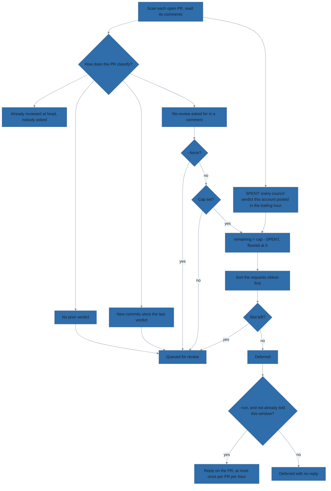

# Batch-reviewing every open PR

`scripts/review-open-prs.sh` points the council at every open PR in a repository
rather than one at a time. It is an operator tool you run yourself — the module
does not ship it and no phase of the pipeline calls it, so `lola install` does
not put it on your disk.

## Setting up a first run

1. Clone this repository. The script ships nowhere else.

   ```bash
   git clone https://github.com/lolables/lola-mod-review-council.git
   ```

2. Work from the clone. Every command below runs there, and it is also the
   directory the agent CLI is launched in.

   ```bash
   cd lola-mod-review-council
   ```

3. Read the reference — it is the authoritative list of flags and environment
   variables, and this page is the tour.

   ```bash
   ./scripts/review-open-prs.sh --help
   ```

4. Install the dependencies: Bash 4+ (the script uses associative arrays), `gh`,
   `jq`, and one of the two agent CLIs the council is installed for — `claude`
   or `opencode`. macOS ships Bash 3.2, so install a current one, as the
   README's [Prerequisites](../README.md#prerequisites) section describes.

   ```bash
   brew install bash jq
   ```

5. Authenticate `gh`. The script refuses to start otherwise.

   ```bash
   gh auth status
   ```

6. Install the council itself where the agent CLI will find it *from this
   directory*:

   - Either a user-scope install, or a project-scope one inside the clone.
     Follow the README's [Install](../README.md#install) section.
   - Nothing checks this up front, so a missing council surfaces as a failed
     review on the first PR, after you have already confirmed the run.
   - The repository you review does not have to be checked out anywhere: given
     a PR number or URL, the council materializes the PR head into its own
     cache — see [Reviewing PRs you haven't checked
     out](../README.md#reviewing-prs-you-havent-checked-out) in the README.

7. Read the plan. Nothing runs and nothing is posted until you pass `--run`. The
   repository is taken from a PR URL argument first, then `--repo owner/name`,
   then the GitHub remote of the current directory — which, from the clone, is
   this module's own repository. Name the one you mean:

   ```
   $ ./scripts/review-open-prs.sh --repo ovh/venom
   Repository: ovh/venom
   Agent CLI: claude
   Unreviewed: 929 927 917 914
   Re-review (new commits): (none)
   Requested re-review: (none)
   Requested re-reviews: 0/unlimited used this hour, next slot (now)
   Skipped (already reviewed at head, unchanged): (none)
   Ignored (author email): 924 920
   Queue (4): 929[quick] 927[quick] 917[standard] 914[standard]

   DRY RUN — nothing will be executed or posted. Re-run with --run to execute.

   PR #929 -> claude -p /review-council\ quick\ https://github.com/ovh/venom/pull/929\ ...
   ```

The bracketed word on the `Queue` line is the PR's effort tier — how expensive a
review it is about to be given. See "The word in brackets" below.

Most of that plan prints on every run. Five lines are conditional:

- `Deferred (hourly cap):` — only when the cap held a request back.
- `Skipped (already reviewed at head, unchanged):` — replaced by
  `Forced re-review of unchanged PRs enabled (--force).` under `--force`.
- `Ignored (author email):` — only on a batch run with a non-empty ignore list.
- `Council marker from another account (queued anyway):` — only when there is one.
- `Effort: forced to '<tier>' for every PR (--effort).` — only under `--effort`.

## How a PR reaches the queue

PRs with no prior council comment are queued first, then PRs whose last review
was for an older commit, then PRs someone asked to have re-reviewed; a PR
already reviewed at its current head is skipped. `--force` jumps that
already-reviewed check — and the hourly cap on comment-requested re-reviews
behind it — while naming a PR by number or URL jumps the **ignore list**
instead, so a named PR that is unchanged and already reviewed needs `--force`
too. Collapsing a verdict comment on GitHub forces a fresh review of that PR by
hand.

The gate-by-gate reasoning, the flowchart, and what the driver accepts as a
prior verdict of its own are in
[How a PR reaches the queue](dev/pr-queue-gates.md).

## Effort tiers

**The word in brackets** is the effort tier, classified from each PR's GitHub
metadata so a lockfile bump does not pay for a full deep review. In the run
above, two small bot PRs earned `quick` and two PRs did not. `deep` is forced by
size or by a changed path that looks security-sensitive; `standard` passes no
effort word at all, leaving the council on its own default. `--effort <tier>`
overrides the classifier for the whole batch.

`quick` needs a bot author, so with the default ignore list (below) it applies
to automation *other than* Dependabot and Renovate — whose PRs are dropped
before they ever reach the classifier. Clear the list with `--no-ignore-emails`
and they are costed like anything else: `quick` only when the PR touches at most
`QUICK_FILES` files, `standard` above that, and `deep` if it crosses
`DEEP_FILES` or a security-sensitive path. A four-file Renovate PR is a
`standard` review, not a `quick` one.

| Variable          | Default | Effect                                                  |
|-------------------|---------|---------------------------------------------------------|
| `DEEP_FILES`      | 10      | changed files at or above this force `deep`             |
| `QUICK_FILES`     | 2       | bot PRs at or below this many files get `quick`         |
| `SECURITY_PATHS`  | see `--help` | extended-regex; any matching changed path forces `deep` |
| `IGNORE_EMAILS`   | Dependabot + Renovate | **replaces** the ignored-author list; empty means ignore nobody |
| `REREVIEW_PER_HOUR` | unset | default for `--requests-per-hour`; unset or empty means no cap, and a non-numeric value exits 2 rather than reading as unlimited |
| `MAX_BUDGET_USD`  | unset   | passed to `claude` to cap the spend of each PR review   |
| `EXTRA_CLAUDE_ARGS` | unset | appended to every `claude` invocation, e.g. `--model opus` |
| `EXTRA_OPENCODE_ARGS` | unset | appended to every `opencode` invocation                |

`opencode run` has no budget flag to translate `MAX_BUDGET_USD` into, so setting
both it and an opencode run is an error. Ignoring the cap would run the whole
batch uncapped on the strength of a setting asking for the opposite, and you
would find out on the invoice.

## Asking for a re-review in a comment

New commits are not the only reason to look again. A maintainer who has answered
the findings — or argued one down — wants the council to read the thread and
respond to it, and nothing has been pushed. Left to the head-sha check alone,
that PR looks exactly like one nobody has touched.

Commenting this on the PR queues it:

```text
/review-council review
```

The line has to stand alone, at column 0. Quoting someone else's request does
not make one, and the command named mid-sentence is a mention. Trailing words
are not accepted — the effort tier decides what a review costs, and the person
asking does not choose it.

**Only admin or write permission counts.** The requester's permission is checked
against the repository, and an unreadable answer refuses the request. This is
the one lookup in the driver that fails closed. Everywhere else, an unanswered
question means "review it", because a duplicate review costs one review; here it
would mean "let a stranger start reviews", and that has no ceiling.

The request must also be **newer than the verdict it asks to replace**, so a
single comment cannot re-trigger a paid review on every run forever.

### Capping what other people can spend

The budget is spent by every verdict this account posts, but only
comment-requested re-reviews are gated by it — so the thing draining the window
is not the thing being held back:



```console
$ ./scripts/review-open-prs.sh --repo voxpupuli/openvox-ca --requests-per-hour 3
Unreviewed: 236 235 234
Re-review (new commits): 189 168
Requested re-review: 166
Deferred (hourly cap): 164
Requested re-reviews: 2/3 used this hour, next slot 2026-08-22T16:42:00Z
Skipped (already reviewed at head, unchanged): 167 165
```

Two people asked; one slot was left, so the older request (#166) took it and
#164 was deferred.

Read `2/3` wider than its label: the numerator is every verdict this account
posted in the trailing hour, not only the requested ones, because the budget
being protected is the API bill. Only requests are *gated* by it, so a genuine
code change is never held back by a busy afternoon. Requests are admitted
oldest-first, capped or not.

There is no state file. The count comes from the verdict comments themselves,
which are timestamped and attributable and already fetched during
classification, so it survives running the driver from another machine or a
different directory. The trade-off is visible in the output rather than hidden:
a run naming a single PR reads only that PR's history, so it sees a narrower
window than a batch does.

A request that does not fit the cap is deferred and told so on its own pull
request, at most once per PR per hour. Replying to every request instead would
hand anyone with write access a way to make your account post repeatedly on a
public thread.

## Ignoring dependency bots

Dependabot and Renovate open PRs faster than a council can review them, and
every review costs money, so PRs written entirely by their commit-author
addresses are dropped before they reach the queue and listed on the
`Ignored (author email)` line.

GitHub puts no email on the pull request itself, so the addresses compared are
the commit authors' — and a PR is ignored only when it has at least one commit
author and *every* one of them is on the list:

| PR contents                                  | Result   |
|----------------------------------------------|----------|
| commits by `renovate[bot]`                   | ignored  |
| commits by `renovate[bot]` **and** a human   | reviewed |
| authorship lookup failed (no addresses)      | reviewed |

One human commit on a Renovate branch is human work, so the PR comes back for
review; a bot-authored rebase or merge commit cannot disqualify somebody's PR;
and a failed lookup costs you a redundant review rather than a silent miss.

Three ways to change the list, and one case where it does not apply:

- `--ignore-email <addr>` adds an address, and may be repeated.
- `--no-ignore-emails` clears the list, so every PR is *considered*. Considered,
  not queued: one already reviewed at its current head is still skipped.
- `IGNORE_EMAILS` **replaces** the built-in list rather than extending it, as a
  comma- or whitespace-separated string. `IGNORE_EMAILS=` (empty) ignores
  nobody. `--ignore-email` then appends to whatever is in effect.
- Naming one PR (`./scripts/review-open-prs.sh 123`) overrides the list. Asking
  for a PR by number or URL says which PR you want, so it is never filtered out
  from under you; the list is triage for batch runs.

It is deliberately separate from `--force`, which decides whether *already
reviewed* PRs get queued — and admits every outstanding re-review request with
them, hourly cap or no. `--force` will not re-review an ignored bot PR.

## Which CLI runs the council

`claude` is preferred when both are installed; otherwise whichever is on `PATH`
is used, and `--cli claude|opencode` picks one explicitly. A `--cli` that is not
installed is an error rather than a silent fallback — the two hosts do not reach
the same models or cost the same. Each host is told which command the arguments
belong to by the route it provides — `claude` expands a leading `/review-council`
inside the prompt it is given, `opencode` selects the command with `--command`
and hands the rest to it — so everything *after* the command name is identical
and only that routing differs:

```
PR #929 -> claude -p /review-council\ quick\ https://github.com/ovh/venom/pull/929\ ...
PR #929 -> opencode run --command review-council --auto quick\ https://github.com/ovh/venom/pull/929\ ...
```

## `--run` asks before it edits anything

Every review ends in a public comment on somebody's pull request, posted by the
account `gh` is authenticated with, so `--run` describes the damage and waits
for you to type `yes` against the queue it just printed:

```
$ ./scripts/review-open-prs.sh --repo ovh/venom --run
...
Queue (4): 929[quick] 927[quick] 917[standard] 914[standard]

WARNING: this makes visible edits on GitHub.

Reviewing 4 pull request(s) in ovh/venom, each handed to claude
with permissions bypassed:

  --permission-mode bypassPermissions

and a prompt telling the council to post its verdict without asking. Expect a
public review comment on every PR in the queue above, authored by the account
gh is authenticated with, plus the API spend of each review.

A re-review request the hourly cap could not admit also draws a short reply on
its own pull request explaining the limit — at most one per pull request per
hour, and only for requests that were authorised in the first place.

Re-run without --run to see the plan alone, or with --yes to skip this prompt.
Type "yes" to proceed:
```

The verdicts are not the only writes, which is why the prompt names the other
one: a deferred request gets a short reply telling whoever asked when the next
slot opens. It is the only comment the driver posts in its own voice rather than
through the council.

Anything but `yes` aborts, and so does having no answer to give — under `cron`,
with `</dev/null`, or on a closed pipe. `--yes` (alias `--no-confirm`) gives that
consent up front for an unattended run. It is deliberately separate from
`--force`, which only decides which PRs get queued — unchanged ones, and the
requests the hourly cap would otherwise defer: forcing a re-review is not the
same act as agreeing to publish one.

## Watching a batch run

With `--run`, PRs are reviewed one at a time, each transcript tee'd to
`./.review-council-logs/<owner>-<repo>-pr-<n>.log`. A PR whose review exits
non-zero is recorded and the batch continues; the script exits 1 at the end and
names every PR that failed.

A review takes tens of minutes, so claude is asked for its structured event
stream rather than the default text — under which `claude -p` prints nothing at
all until its closing message, leaving nothing to watch. The log keeps the
events verbatim; the terminal gets a line per step as they arrive:

```
14:02:31 → Task divisor-adversary-code
14:02:33   Dispatching 5 reviewers over 2 subsystems.
14:41:08 done — $8.23, 57 turns
```

Set `EXTRA_CLAUDE_ARGS="--output-format json"` to choose a different format;
that replaces the streaming default and the progress rendering along with it.

## Common invocations

```
./scripts/review-open-prs.sh --help                 # full reference
./scripts/review-open-prs.sh --run                  # the repo of the current directory
./scripts/review-open-prs.sh --repo owner/name --run  # a different repository
./scripts/review-open-prs.sh 123 --run              # one PR
./scripts/review-open-prs.sh --run --yes            # unattended, no confirmation
./scripts/review-open-prs.sh --requests-per-hour 3 --run  # cap comment-requested re-reviews
./scripts/review-open-prs.sh --cli opencode --run   # review through opencode
./scripts/review-open-prs.sh --no-ignore-emails --run              # bot PRs too
./scripts/review-open-prs.sh --ignore-email ci@corp.example --run  # skip one more
./scripts/review-open-prs.sh --force --effort deep --run
```
