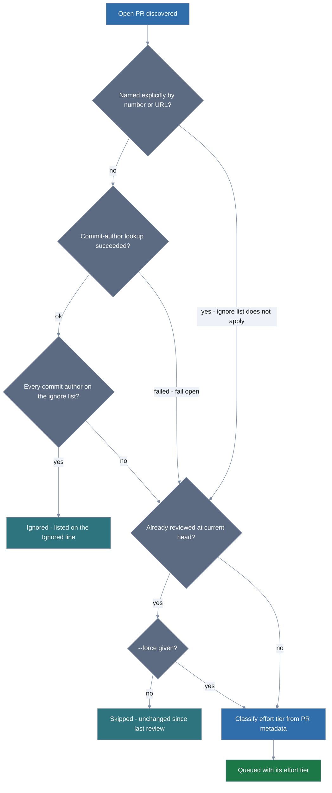

# Batch-reviewing every open PR

`scripts/review-open-prs.sh` points the council at every open PR in a repository
rather than one at a time. It is an operator tool you run yourself — the module
does not ship it and no phase of the pipeline calls it, so `lola install` does
not put it on your disk. Clone this repository to get it, and run it from the
clone:

```bash
git clone https://github.com/lolables/lola-mod-review-council.git
cd lola-mod-review-council
./scripts/review-open-prs.sh --help
```

It needs Bash 4+ (it uses associative arrays), `gh` (authenticated), `jq`, and
one of the two agent CLIs the council is installed for: `claude` or `opencode`.
macOS ships Bash 3.2, so install a current one — `brew install bash jq` — as the
README's Prerequisites section describes. The council itself must already be
installed in whatever repository you point it at.

Nothing runs and nothing is posted until you pass `--run`, so start by reading
the plan:

```
$ ./scripts/review-open-prs.sh --repo ovh/venom
Repository: ovh/venom
Agent CLI: claude
Unreviewed: 929 927 917 914
Re-review (new commits): (none)
Skipped (already reviewed at head, unchanged): (none)
Ignored (author email): 924 920
Queue (4): 929[quick] 927[quick] 917[standard] 914[standard]

DRY RUN — nothing will be executed or posted. Re-run with --run to execute.

PR #929 -> claude -p /review-council\ quick\ https://github.com/ovh/venom/pull/929\ ...
```

## How a PR reaches the queue

Five gates decide each PR's fate, and the two overrides cross rather than nest:
naming a PR by number or URL jumps the **ignore list** but still respects the
already-reviewed check, while `--force` jumps the **already-reviewed** check but
never rescues an ignored bot PR. So a named, unchanged, already-reviewed PR
needs `--force` as well. A failed authorship lookup fails open — the PR carries
on to the reviewed check rather than dropping out.



**Queue order.** PRs with no prior council comment go first, then PRs whose last
review was for an older commit. A PR already reviewed at its current head is
skipped; `--force` queues it anyway. Both facts come from the hidden marker the
council embeds in every comment it posts (see "Posting the verdict to a PR" in
the README). A failed lookup queues the PR rather than skipping it, so a flaky
API call costs you a redundant review instead of a silently missed one.

**The word in brackets** is the effort tier, classified from each PR's GitHub
metadata so a lockfile bump does not pay for a full deep review. In the run
above, two small bot PRs earned `quick` and two PRs did not. `deep` is forced by
size or by a changed path that looks security-sensitive; `standard` passes no
effort word at all, leaving the council on its own default. `--effort <tier>`
overrides the classifier for the whole batch.

`quick` needs a bot author, so with the default ignore list (below) it applies
to automation *other than* Dependabot and Renovate — whose PRs are dropped
before they are ever costed. Clear the list with `--no-ignore-emails` and those
PRs come back as `quick` rather than as full reviews.

| Variable          | Default | Effect                                                  |
|-------------------|---------|---------------------------------------------------------|
| `DEEP_FILES`      | 10      | changed files at or above this force `deep`             |
| `QUICK_FILES`     | 2       | bot PRs at or below this many files get `quick`         |
| `SECURITY_PATHS`  | see `--help` | extended-regex; any matching changed path forces `deep` |
| `IGNORE_EMAILS`   | Dependabot + Renovate | **replaces** the ignored-author list; empty means ignore nobody |
| `MAX_BUDGET_USD`  | unset   | passed to `claude` to cap the spend of each PR review   |
| `EXTRA_CLAUDE_ARGS` | unset | appended to every `claude` invocation, e.g. `--model opus` |
| `EXTRA_OPENCODE_ARGS` | unset | appended to every `opencode` invocation                |

`opencode run` has no budget flag to translate `MAX_BUDGET_USD` into, so setting
both it and an opencode run is an error. Ignoring the cap would run the whole
batch uncapped on the strength of a setting asking for the opposite, and you
would find out on the invoice.

## Ignoring dependency bots

Dependabot and Renovate open PRs faster than a council can review them, and
every review costs money, so PRs written entirely by their commit-author
addresses are dropped before they reach the queue and listed on the
`Ignored (author email)` line.

GitHub puts no email on the pull request itself, so the addresses compared are
the commit authors' — and a PR is ignored only when it has at least one commit
author and *every* one of them is on the list:

| PR contents                                  | Result   |
|----------------------------------------------|----------|
| commits by `renovate[bot]`                   | ignored  |
| commits by `renovate[bot]` **and** a human   | reviewed |
| authorship lookup failed (no addresses)      | reviewed |

One human commit on a Renovate branch is human work, so the PR comes back for
review; a bot-authored rebase or merge commit cannot disqualify somebody's PR;
and a failed lookup costs you a redundant review rather than a silent miss.

Three ways to change the list, and one case where it does not apply:

- `--ignore-email <addr>` adds an address, and may be repeated.
- `--no-ignore-emails` clears the list, queueing every PR.
- `IGNORE_EMAILS` **replaces** the built-in list rather than extending it, as a
  comma- or whitespace-separated string. `IGNORE_EMAILS=` (empty) ignores
  nobody. `--ignore-email` then appends to whatever is in effect.
- Naming one PR (`./scripts/review-open-prs.sh 123`) overrides the list. Asking
  for a PR by number or URL says which PR you want, so it is never filtered out
  from under you; the list is triage for batch runs.

It is deliberately separate from `--force`, which decides only whether *already
reviewed* PRs get queued. `--force` will not re-review an ignored bot PR.

## Which CLI runs the council

`claude` is preferred when both are installed; otherwise whichever is on `PATH`
is used, and `--cli claude|opencode` picks one explicitly. A `--cli` that is not
installed is an error rather than a silent fallback — the two hosts do not reach
the same models or cost the same. They take the command by the route each
provides for it, so the argument string is identical and only the wrapper
differs:

```
PR #929 -> claude -p /review-council\ quick\ https://github.com/ovh/venom/pull/929\ ...
PR #929 -> opencode run --command review-council --auto quick\ https://github.com/ovh/venom/pull/929\ ...
```

## `--run` asks before it edits anything

Every review ends in a public comment on somebody's pull request, posted by the
account `gh` is authenticated with, so `--run` describes the damage and waits
for you to type `yes` against the queue it just printed:

```
$ ./scripts/review-open-prs.sh --repo ovh/venom --run
...
Queue (4): 929[quick] 927[quick] 917[standard] 914[standard]

WARNING: this makes visible edits on GitHub.

Reviewing 4 pull request(s) in ovh/venom, each handed to claude
with permissions bypassed:

  --permission-mode bypassPermissions

and a prompt telling the council to post its verdict without asking. Expect a
public review comment on every PR in the queue above, authored by the account
gh is authenticated with, plus the API spend of each review.

Re-run without --run to see the plan alone, or with --yes to skip this prompt.
Type "yes" to proceed:
```

Anything but `yes` aborts, and so does having no answer to give — under `cron`,
with `</dev/null`, or on a closed pipe. `--yes` (alias `--no-confirm`) gives that
consent up front for an unattended run. It is deliberately separate from
`--force`, which only decides whether unchanged PRs get queued: forcing a
re-review is not the same act as agreeing to publish one.

## Watching a batch run

With `--run`, PRs are reviewed one at a time, each transcript tee'd to
`./.review-council-logs/<owner>-<repo>-pr-<n>.log`. A PR whose review exits
non-zero is recorded and the batch continues; the script exits 1 at the end and
names every PR that failed.

A review takes tens of minutes, so claude is asked for its structured event
stream rather than the default text — under which `claude -p` prints nothing at
all until its closing message, leaving nothing to watch. The log keeps the
events verbatim; the terminal gets a line per step as they arrive:

```
14:02:31 → Task divisor-adversary-code
14:02:33   Dispatching 5 reviewers over 2 subsystems.
14:41:08 done — $8.23, 57 turns
```

Set `EXTRA_CLAUDE_ARGS="--output-format json"` to choose a different format;
that replaces the streaming default and the progress rendering along with it.

## Common invocations

```
./scripts/review-open-prs.sh --help                 # full reference
./scripts/review-open-prs.sh --run                  # current repo, every PR that needs it
./scripts/review-open-prs.sh 123 --run              # one PR
./scripts/review-open-prs.sh --run --yes            # unattended, no confirmation
./scripts/review-open-prs.sh --cli opencode --run   # review through opencode
./scripts/review-open-prs.sh --no-ignore-emails --run              # bot PRs too
./scripts/review-open-prs.sh --ignore-email ci@corp.example --run  # skip one more
./scripts/review-open-prs.sh --force --effort deep --run
```
