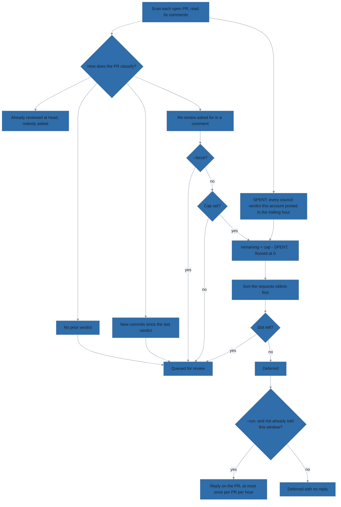

# Batch-reviewing every open PR

`scripts/review-open-prs.sh` points the council at every open PR in a repository
rather than one at a time. It is an operator tool you run yourself — the module
does not ship it and no phase of the pipeline calls it, so `lola install` does
not put it on your disk.

Its read-only companion, `scripts/review-pr-status.sh`, reports where every open
PR already stands without reviewing anything. See
[Seeing where every PR stands](#seeing-where-every-pr-stands).

## Setting up a first run

1. Clone this repository. The script ships nowhere else.

   ```bash
   git clone https://github.com/lolables/lola-mod-review-council.git
   ```

2. Work from the clone. Every command below runs there, and it is also the
   directory the agent CLI is launched in.

   ```bash
   cd lola-mod-review-council
   ```

3. Read the reference — it is the authoritative list of flags and environment
   variables, and this page is the tour.

   ```bash
   ./scripts/review-open-prs.sh --help
   ```

4. Install the dependencies: Bash 4+ (the script uses associative arrays), `gh`,
   `jq`, and one of the two agent CLIs the council is installed for — `claude`
   or `opencode`. macOS ships Bash 3.2, so install a current one, as the
   README's [Prerequisites](../README.md#prerequisites) section describes.

   ```bash
   brew install bash jq
   ```

5. Authenticate `gh`. The script refuses to start otherwise.

   ```bash
   gh auth status
   ```

6. Install the council itself where the agent CLI will find it *from this
   directory*:

   - Either a user-scope install, or a project-scope one inside the clone.
     Follow the README's [Install](../README.md#install) section.
   - Nothing checks this up front, so a missing council surfaces as a failed
     review on the first PR, after you have already confirmed the run.
   - The repository you review does not have to be checked out anywhere: given
     a PR number or URL, the council materializes the PR head into its own
     cache — see [Reviewing PRs you haven't checked
     out](../README.md#reviewing-prs-you-havent-checked-out) in the README.

7. Read the plan. Nothing runs and nothing is posted until you pass `--run`. The
   repository is taken from a PR URL argument first, then `--repo owner/name`,
   then the GitHub remote of the current directory — which, from the clone, is
   this module's own repository. Name the one you mean:

   ```
   $ ./scripts/review-open-prs.sh --repo ovh/venom
   Repository: ovh/venom
   Agent CLI: claude
   Unreviewed: 929 927 917 914
   Re-review (new commits): (none)
   Requested re-review: (none)
   Requested re-reviews: 0/unlimited used this hour, next slot (now)
   Skipped (already reviewed at head, unchanged): (none)
   Ignored (author email): 924 920
   Queue (4): 929[quick] 927[quick] 917[standard] 914[standard]

   DRY RUN — nothing will be executed or posted. Re-run with --run to execute.

   PR #929 -> claude -p /review-council\ quick\ https://github.com/ovh/venom/pull/929\ ...
   ```

The bracketed word on the `Queue` line is the PR's effort tier — how expensive a
review it is about to be given. See "The word in brackets" below.

Most of that plan prints on every run. Six lines are conditional:

- `Deferred (hourly cap):` — only when the cap held a request back.
- `Skipped (already reviewed at head, unchanged):` — replaced by
  `Forced re-review of unchanged PRs enabled (--force).` under `--force`.
- `Ignored (author email):` — only on a batch run with a non-empty ignore list.
- `Ignored (approved):` — only on a batch run under `--ignore-approved`.
- `Council marker from another account (queued anyway):` — only when there is one.
- `Effort: forced to '<tier>' for every PR (--effort).` — only under `--effort`.

## How a PR reaches the queue

PRs with no prior council comment are queued first, then PRs whose last review
was for an older commit, then PRs someone asked to have re-reviewed; a PR
already reviewed at its current head is skipped. `--force` jumps that
already-reviewed check — and the hourly cap on comment-requested re-reviews
behind it — while naming a PR by number or URL jumps the **ignore list**
instead, so a named PR that is unchanged and already reviewed needs `--force`
too. Collapsing a verdict comment on GitHub forces a fresh review of that PR by
hand.

The gate-by-gate reasoning, the flowchart, and what the driver accepts as a
prior verdict of its own are in
[How a PR reaches the queue](dev/pr-queue-gates.md).

## Effort tiers

**The word in brackets** is the effort tier, classified from each PR's GitHub
metadata so a lockfile bump does not pay for a full deep review. In the run
above, two small bot PRs earned `quick` and two PRs did not. `deep` is forced by
size or by a changed path that looks security-sensitive; `standard` passes no
effort word at all, leaving the council on its own default. `--effort <tier>`
overrides the classifier for the whole batch.

`quick` needs a bot author, so with the default ignore list (below) it applies
to automation *other than* Dependabot and Renovate — whose PRs are dropped
before they ever reach the classifier. Clear the list with `--no-ignore-emails`
and they are costed like anything else: `quick` only when the PR touches at most
`QUICK_FILES` files, `standard` above that, and `deep` if it crosses
`DEEP_FILES` or a security-sensitive path. A four-file Renovate PR is a
`standard` review, not a `quick` one.

| Variable          | Default | Effect                                                  |
|-------------------|---------|---------------------------------------------------------|
| `DEEP_FILES`      | 10      | changed files at or above this force `deep`             |
| `QUICK_FILES`     | 2       | bot PRs at or below this many files get `quick`         |
| `SECURITY_PATHS`  | see `--help` | extended-regex; any matching changed path forces `deep` |
| `IGNORE_EMAILS`   | Dependabot + Renovate | **replaces** the ignored-author list; empty means ignore nobody |
| `REREVIEW_PER_HOUR` | unset | default for `--requests-per-hour`; unset or empty means no cap, and a non-numeric value exits 2 rather than reading as unlimited |
| `MAX_BUDGET_USD`  | unset   | passed to `claude` to cap the spend of each PR review   |
| `EXTRA_CLAUDE_ARGS` | unset | appended to every `claude` invocation, e.g. `--model opus` |
| `EXTRA_OPENCODE_ARGS` | unset | appended to every `opencode` invocation                |

`opencode run` has no budget flag to translate `MAX_BUDGET_USD` into, so setting
both it and an opencode run is an error. Ignoring the cap would run the whole
batch uncapped on the strength of a setting asking for the opposite, and you
would find out on the invoice.

## Asking for a re-review in a comment

New commits are not the only reason to look again. A maintainer who has answered
the findings — or argued one down — wants the council to read the thread and
respond to it, and nothing has been pushed. Left to the head-sha check alone,
that PR looks exactly like one nobody has touched.

Commenting this on the PR queues it:

```text
/review-council review
```

The line has to stand alone, at column 0. Quoting someone else's request does
not make one, and the command named mid-sentence is a mention. Trailing words
are not accepted — the effort tier decides what a review costs, and the person
asking does not choose it.

**Only admin or write permission counts.** The requester's permission is checked
against the repository, and an unreadable answer refuses the request. This is
the one lookup in the driver that fails closed. Everywhere else, an unanswered
question means "review it", because a duplicate review costs one review; here it
would mean "let a stranger start reviews", and that has no ceiling.

The request must also be **newer than the verdict it asks to replace**, so a
single comment cannot re-trigger a paid review on every run forever.

### Capping what other people can spend

The budget is spent by every verdict this account posts, but only
comment-requested re-reviews are gated by it — so the thing draining the window
is not the thing being held back:



```console
$ ./scripts/review-open-prs.sh --repo voxpupuli/openvox-ca --requests-per-hour 3
Unreviewed: 236 235 234
Re-review (new commits): 189 168
Requested re-review: 166
Deferred (hourly cap): 164
Requested re-reviews: 2/3 used this hour, next slot 2026-08-22T16:42:00Z
Skipped (already reviewed at head, unchanged): 167 165
```

Two people asked; one slot was left, so the older request (#166) took it and
#164 was deferred.

Read `2/3` wider than its label: the numerator is every verdict this account
posted in the trailing hour, not only the requested ones, because the budget
being protected is the API bill. Only requests are *gated* by it, so a genuine
code change is never held back by a busy afternoon. Requests are admitted
oldest-first, capped or not.

There is no state file. The count comes from the verdict comments themselves,
which are timestamped and attributable and already fetched during
classification, so it survives running the driver from another machine or a
different directory. The trade-off is visible in the output rather than hidden:
a run naming a single PR reads only that PR's history, so it sees a narrower
window than a batch does.

A request that does not fit the cap is deferred and told so on its own pull
request, at most once per PR per hour. Replying to every request instead would
hand anyone with write access a way to make your account post repeatedly on a
public thread.

## Ignoring dependency bots

Dependabot and Renovate open PRs faster than a council can review them, and
every review costs money, so PRs written entirely by their commit-author
addresses are dropped before they reach the queue and listed on the
`Ignored (author email)` line.

GitHub puts no email on the pull request itself, so the addresses compared are
the commit authors' — and a PR is ignored only when it has at least one commit
author and *every* one of them is on the list:

| PR contents                                  | Result   |
|----------------------------------------------|----------|
| commits by `renovate[bot]`                   | ignored  |
| commits by `renovate[bot]` **and** a human   | reviewed |
| authorship lookup failed (no addresses)      | reviewed |

One human commit on a Renovate branch is human work, so the PR comes back for
review; a bot-authored rebase or merge commit cannot disqualify somebody's PR;
and a failed lookup costs you a redundant review rather than a silent miss.

Three ways to change the list, and one case where it does not apply:

- `--ignore-email <addr>` adds an address, and may be repeated.
- `--no-ignore-emails` clears the list, so every PR is *considered*. Considered,
  not queued: one already reviewed at its current head is still skipped.
- `IGNORE_EMAILS` **replaces** the built-in list rather than extending it, as a
  comma- or whitespace-separated string. `IGNORE_EMAILS=` (empty) ignores
  nobody. `--ignore-email` then appends to whatever is in effect.
- Naming one PR (`./scripts/review-open-prs.sh 123`) overrides the list. Asking
  for a PR by number or URL says which PR you want, so it is never filtered out
  from under you; the list is triage for batch runs.

It is deliberately separate from `--force`, which decides whether *already
reviewed* PRs get queued — and admits every outstanding re-review request with
them, hourly cap or no. `--force` will not re-review an ignored bot PR.

## Ignoring PRs that are already approved

`--ignore-approved` drops any PR the forge reports as approved before it is
classified, and lists it on the `Ignored (approved)` line. A PR somebody has
approved has already had a human decide on it, so this is the cheapest way to
keep the council off the ones that are only waiting to be merged.

The value read is GitHub's own `reviewDecision`, and only `APPROVED` counts:

| `reviewDecision`     | Result   |
|----------------------|----------|
| `APPROVED`           | ignored  |
| `CHANGES_REQUESTED`  | reviewed |
| `REVIEW_REQUIRED`    | reviewed |
| none, or lookup failed | reviewed |

The last three rows are one rule: anything that is not an approval is a PR that
still wants attention, and an unreadable answer costs you a redundant review
rather than a silent miss.

Two things the flag deliberately does not do:

- **It is not a default, and has no environment variable.** An approval says
  what should happen to a PR, not that this council has looked at it. Turning it
  on is a decision about a particular run.
- **It does not check *what* was approved.** Unless the branch is protected with
  "dismiss stale approvals", GitHub keeps an approval across later pushes, so a
  PR approved and then pushed to still reads as `APPROVED` and is skipped with
  those new commits unreviewed. Leave the flag off for a run that should see
  them.

Like the address list above, this is batch triage: naming one PR
(`./scripts/review-open-prs.sh 123 --ignore-approved`) reviews that PR whatever
its review decision says.

## Which CLI runs the council

`claude` is preferred when both are installed; otherwise whichever is on `PATH`
is used, and `--cli claude|opencode` picks one explicitly. A `--cli` that is not
installed is an error rather than a silent fallback — the two hosts do not reach
the same models or cost the same. Each host is told which command the arguments
belong to by the route it provides — `claude` expands a leading `/review-council`
inside the prompt it is given, `opencode` selects the command with `--command`
and hands the rest to it — so everything *after* the command name is identical
and only that routing differs:

```
PR #929 -> claude -p /review-council\ quick\ https://github.com/ovh/venom/pull/929\ ...
PR #929 -> opencode run --command review-council --auto quick\ https://github.com/ovh/venom/pull/929\ ...
```

## `--run` asks before it edits anything

Every review ends in a public comment on somebody's pull request, posted by the
account `gh` is authenticated with, so `--run` describes the damage and waits
for you to type `yes` against the queue it just printed:

```
$ ./scripts/review-open-prs.sh --repo ovh/venom --run
...
Queue (4): 929[quick] 927[quick] 917[standard] 914[standard]

WARNING: this makes visible edits on GitHub.

Reviewing 4 pull request(s) in ovh/venom, each handed to claude
with permissions bypassed:

  --permission-mode bypassPermissions

and a prompt telling the council to post its verdict without asking. Expect a
public review comment on every PR in the queue above, authored by the account
gh is authenticated with, plus the API spend of each review.

A re-review request the hourly cap could not admit also draws a short reply on
its own pull request explaining the limit — at most one per pull request per
hour, and only for requests that were authorised in the first place.

Re-run without --run to see the plan alone, or with --yes to skip this prompt.
Type "yes" to proceed:
```

The verdicts are not the only writes, which is why the prompt names the other
one: a deferred request gets a short reply telling whoever asked when the next
slot opens. It is the only comment the driver posts in its own voice rather than
through the council.

Anything but `yes` aborts, and so does having no answer to give — under `cron`,
with `</dev/null`, or on a closed pipe. `--yes` (alias `--no-confirm`) gives that
consent up front for an unattended run. It is deliberately separate from
`--force`, which only decides which PRs get queued — unchanged ones, and the
requests the hourly cap would otherwise defer: forcing a re-review is not the
same act as agreeing to publish one.

## Watching a batch run

With `--run`, PRs are reviewed one at a time, each transcript tee'd to
`./.review-council-logs/<owner>-<repo>-pr-<n>.log`. A PR whose review exits
non-zero is recorded and the batch continues; the script exits 1 at the end and
names every PR that failed.

A review takes tens of minutes, so claude is asked for its structured event
stream rather than the default text — under which `claude -p` prints nothing at
all until its closing message, leaving nothing to watch. The log keeps the
events verbatim; the terminal gets a line per step as they arrive:

```
14:02:31 → Task divisor-adversary-code
14:02:33   Dispatching 5 reviewers over 2 subsystems.
14:41:08 done — $8.23, 57 turns
```

Set `EXTRA_CLAUDE_ARGS="--output-format json"` to choose a different format;
that replaces the streaming default and the progress rendering along with it.

## Common invocations

```
./scripts/review-open-prs.sh --help                 # full reference
./scripts/review-open-prs.sh --run                  # the repo of the current directory
./scripts/review-open-prs.sh --repo owner/name --run  # a different repository
./scripts/review-open-prs.sh 123 --run              # one PR
./scripts/review-open-prs.sh --run --yes            # unattended, no confirmation
./scripts/review-open-prs.sh --requests-per-hour 3 --run  # cap comment-requested re-reviews
./scripts/review-open-prs.sh --cli opencode --run   # review through opencode
./scripts/review-open-prs.sh --no-ignore-emails --run              # bot PRs too
./scripts/review-open-prs.sh --ignore-email ci@corp.example --run  # skip one more
./scripts/review-open-prs.sh --ignore-approved --run               # skip approved PRs
./scripts/review-open-prs.sh --force --effort deep --run
```

## Seeing where every PR stands

`scripts/review-pr-status.sh` reports the backlog the driver would work through,
without working through any of it. It posts no comment, launches no agent CLI
and spends nothing — every call it makes is a read, which is what makes it safe
to run on a timer, against somebody else's repository, or while a batch review
is already in flight. It needs `gh` and `jq`, and nothing else.

Both scripts classify PRs through the same code, so this is the driver's own
opinion rather than a second one about it. A PR reported here as `unreviewed` is
a PR `review-open-prs.sh` would queue.

```console
$ ./scripts/review-pr-status.sh --repo acme/widgets
review-council status — acme/widgets  (accounts: all)
6 open · 2 need review · 1 requested · 2 current · 1 ignored
Requested re-reviews: 0/unlimited used this hour, next slot (now)

PR     STATE        VERDICT            BY          REVIEWED   WOULD RUN
#241   up-to-date   APPROVE            council-bot 2h ago     standard
#240   up-to-date*  REQUEST CHANGES    otheruser   1d ago     deep
#239   unreviewed   —                  —           —          deep
#238   stale        APPROVE            council-bot 3d ago     standard
#237   requested    REQUEST CHANGES    council-bot 5h ago     standard
#236   ignored      —                  —           —          —

* reviewed by another account; your driver would review it again
```

`VERDICT` is the verdict word read out of the same comment the state was decided
from, shown verbatim rather than mapped onto a known vocabulary. `BY` is the
account that posted it. Anything that does not exist — no verdict, no review
time — prints an em dash rather than a blank or a zero.

`BY` is the one column sized to its content: it grows to fit the longest account
name in the report and never shortens one. `dependabot[bot]` is fifteen
characters, and a login clipped to `dependabot[bo…` cannot be pasted back into
`--account`. `VERDICT` still clips, because it is free text out of a markdown
heading with no upper bound.

Five words describe a PR, and every PR gets exactly one:

| State        | Meaning                                                              |
|--------------|----------------------------------------------------------------------|
| `unreviewed` | no usable prior verdict                                              |
| `stale`      | a verdict exists, but for an older commit                            |
| `requested`  | reviewed at head, and someone with write access asked in a comment   |
| `up-to-date` | reviewed at head, and nobody has asked for more                      |
| `ignored`    | every commit author is on the ignore list, so the driver would drop it |

The ignore list is the same one the driver uses, and the same three switches
change it: `--ignore-email <addr>` (repeatable), `--no-ignore-emails`, and the
`IGNORE_EMAILS` environment variable. Naming one PR by number or URL overrides
the list, exactly as it does for the driver. What differs is the outcome — an
ignored PR is *reported*, on its own row, rather than dropped silently.

### `WOULD RUN` is a forecast, not a record

`#239` above is `unreviewed` and still shows `deep`. That is not history leaking
into the row. The tier is computed from the PR's **current** metadata — its
changed-file count and whether any changed path looks security-sensitive — so
every PR has one whether or not it has ever been reviewed. Read the column as
"what this would cost if you queued it now".

An `ignored` PR shows an em dash instead, because it would not be reviewed at
all. `DEEP_FILES`, `QUICK_FILES` and `SECURITY_PATHS` tune the classifier here
the same way they tune it for the driver; see [Effort tiers](#effort-tiers).

### Whose reviews count: `--account`

The driver only trusts a marker **it** posted, because the marker is public and
anyone who can comment can type one. A report under that rule is close to
useless when the council runs from a bot account or from a second machine: every
one of those verdicts reads as `unreviewed`. So the status script defaults to
counting everybody's.

| Value                  | Counts                                          |
|------------------------|-------------------------------------------------|
| `--account all`        | any account's verdict. The default              |
| `--account self`       | only the account `gh` is authenticated as       |
| `--account <login>`    | only that account's                             |

The widened default costs one piece of precision, and the `*` is where it is
paid. `#240` is reviewed at its head by `otheruser`, so the report says
`up-to-date` — but your own driver refuses that marker and **would review the PR
again**. The star and its footnote are what keep the two statements from
contradicting each other.

`--account self` is the one scope under which `STATE` predicts the driver
exactly, which is what you want when you are debugging its queue. It also stops
naming reviewers, since the answer is always "you" — so `BY` shrinks to its
heading:

```console
$ ./scripts/review-pr-status.sh --repo acme/widgets --account self
review-council status — acme/widgets  (accounts: self)
6 open · 3 need review · 1 requested · 1 current · 1 ignored
Requested re-reviews: 0/unlimited used this hour, next slot (now)

PR     STATE        VERDICT            BY REVIEWED   WOULD RUN
#241   up-to-date   APPROVE            —  2h ago     standard
#240   unreviewed   —                  —  —          deep
#239   unreviewed   —                  —  —          deep
#238   stale        APPROVE            —  3d ago     standard
#237   requested    REQUEST CHANGES    —  5h ago     standard
#236   ignored      —                  —  —          —

Council marker from another account: 240:otheruser
      A token rotated between runs reads this way, and so does a forged
      marker. Neither is trusted, so these PRs report as unreviewed.
```

A marker that the scope did **not** count is named under the table like that,
and its PR still reports as `unreviewed`. A rotated token and a forged marker
look identical from the timeline, and neither is something to trust. One that
*was* counted appears in `BY` instead and is not listed twice.

### The flags

| Flag                     | Effect                                                        |
|--------------------------|---------------------------------------------------------------|
| `123` or a PR URL        | report on that one PR; a URL also fixes the repository        |
| `--repo owner/name`      | a repository other than the current directory's               |
| `--account <login>\|all\|self` | whose verdicts count (default `all`)                    |
| `--json`                 | one machine-readable envelope instead of the table            |
| `--tsv`                  | one tab-separated line per PR, no header; refuses `--json`    |
| `--exit-code`            | exit 10 rather than 0 when anything is pending                |
| `--ignore-email <addr>`  | add an address to the ignore list; repeatable                 |
| `--no-ignore-emails`     | clear the list and report every PR on its own terms           |
| `-h`, `--help`           | the full reference, which is the file's own header            |

The repository is resolved from a PR URL argument first, then `--repo`, then the
GitHub remote of the current directory — the same order the driver uses. A
`--repo` that disagrees with the URL beside it is an error, not a silent winner.

### `--json`

`--json` replaces the table with a single envelope on stdout and drops every
human decoration that went with it: no summary line, no ledger line, no asterisk
and no footnote. That is what makes it safe to pipe into `jq`.

```console
$ ./scripts/review-pr-status.sh --repo acme/widgets 240 --json
{
  "repo": "acme/widgets",
  "generated_at": "2026-08-23T03:16:46Z",
  "account_scope": "all",
  "window": {
    "start": "2026-08-23T02:16:46Z",
    "spent": 0,
    "limit": null,
    "next_slot": "(now)"
  },
  "pull_requests": [
    {
      "number": 240,
      "state": "up-to-date",
      "head": "b2c3d4e5f60718293a4b5c6d7e8f90123456789a",
      "reviewed_sha": "b2c3d4e5f60718293a4b5c6d7e8f90123456789a",
      "reviewed_at": "2026-08-22T02:16:36Z",
      "reviewed_by": "otheruser",
      "reviewed_is_ours": false,
      "verdict": "REQUEST CHANGES",
      "effort": "deep",
      "foreign_marker": null
    }
  ]
}
```

Three things to know about the shape:

- An absent value is `null`, never `""` and never the table's em dash.
- `reviewed_is_ours` is a real boolean — the machine-readable form of the
  table's `*`, so nothing has to scrape a presentation character back out.
- `effort` keeps its name even though the column above it now reads
  `WOULD RUN`. The rename fixed a label; renaming the key would have broken
  every reader for no gain.

`window.limit` is `null` when `REREVIEW_PER_HOUR` is unset.

### `--tsv`

`--json` is the right shape for a program that wants the whole report.
`--tsv` is for the shell pipeline that wants a column out of it. One
tab-separated line per PR, no header line, and the same decoration dropped: no
summary line, no ledger line, no asterisk, no footnote, no em dashes.

```console
$ ./scripts/review-pr-status.sh --repo acme/widgets --tsv
241	up-to-date	APPROVE	council-bot	1	2026-08-23T10:39:05Z	standard	aaaaa41	aaaaa41
240	up-to-date	REQUEST CHANGES	otheruser	0	2026-08-22T12:39:05Z	deep	aaaaa40	aaaaa40
239	unreviewed			0		deep	aaaaa39	
238	stale	APPROVE	council-bot	1	2026-08-20T12:39:05Z	standard	aaaaa38	0000001
237	requested	REQUEST CHANGES	council-bot	1	2026-08-23T07:39:05Z	standard	aaaaa37	aaaaa37
236	ignored			0			aaaaa36	
```

Every gap above is one tab, including the wide-looking runs. `#239` has never
been reviewed, so fields 3, 4, 6 and 9 are **empty and still there** — an absent
value is an empty field, never an em dash, never `null`, never `-`. That is what
makes a fixed field number safe to rely on:

```console
$ ./scripts/review-pr-status.sh --repo acme/widgets --tsv |
    awk -F'\t' '$2 == "unreviewed" || $2 == "stale" { print $1, $7 }'
239 deep
238 standard
```

Two fields, no JSON parser, and the answer is a work queue with a price on each
line. The nine fields, in order:

| # | Field          | Notes                                                        |
|---|----------------|--------------------------------------------------------------|
| 1 | `number`       |                                                              |
| 2 | `state`        | the same five words the table prints, with no `*`            |
| 3 | `verdict`      | verbatim, and **not** clipped — the table's width is a layout concern |
| 4 | `by`           | the account whose verdict the state rests on                 |
| 5 | `is_ours`      | `1` or `0`, the machine form of the table's `*`              |
| 6 | `reviewed_at`  | the ISO-8601 timestamp, not `2h ago`                         |
| 7 | `effort`       | empty for an `ignored` PR, as it is `null` in `--json`       |
| 8 | `head`         |                                                              |
| 9 | `reviewed_sha` |                                                              |

`reviewed_at` carries the timestamp for the same reason `--json` does: an age is
computable from a timestamp, and a timestamp is not recoverable from `2h ago`.

**Fields are safe to split on.** Every value has its tabs, carriage returns and
newlines replaced with a single space before it is written. A verdict is
whatever somebody typed after `## 🟢 Review Council: ` in a heading, so a tab in
one would otherwise shift every field after it and `cut -f5` would read the
wrong column with nothing anywhere reporting an error.

`--account` applies unchanged, and field 5 is where its effect shows per row.
`--exit-code` applies unchanged too, and gives the same code the table and the
JSON give for the same repository — the status is about the classification, not
the presentation. Passing `--tsv` and `--json` together exits 2 rather than one
of them silently winning; they are alternative renderings, and asking for both
is a mistake in whatever wrapper did it.

### Exit codes

Without `--exit-code` the report *is* the answer, and a backlog is not a
failure: the script exits 0 whenever it produced one.

| Code | Meaning                                                                 |
|------|-------------------------------------------------------------------------|
| `0`  | reported; with `--exit-code`, nothing is `unreviewed`, `stale` or `requested` |
| `10` | `--exit-code` only: reported, and at least one PR is pending             |
| `1`  | a hard failure — `gh` unauthenticated, the repository unresolvable, a named PR that does not exist, or a listing that would not answer |
| `2`  | a usage or configuration error — an unknown flag, a `--repo` that disagrees with the PR URL beside it, a non-numeric `DEEP_FILES` |

`up-to-date` and `ignored` PRs are never pending, so a repository whose every
open PR is current or bot-authored exits 0 under `--exit-code` too.

The reason 10 is not 1 is the wrapper:

```bash
review-pr-status.sh --repo acme/widgets --exit-code || alert
```

Reusing 1 would fire that identically for "three PRs are waiting" and "GitHub is
down" — opposite situations, one of them the system working and telling you so,
the other the check having failed and telling you nothing. `--exit-code` never
turns a hard failure into 10 or 0; 1 and 2 keep the meanings they already have
in both scripts.

### Both scripts share `scripts/lib/`

`common.sh`, `comments.sh` and `prs.sh` hold the process setup, the marker
readers and the PR classification that the driver and the status script both
use. Neither script is a single file you can copy on its own any more — it needs
`lib/` beside it.

Each one finds `lib/` by resolving its own path through every symlink hop, so a
link on your `PATH` works and keeps working:

```bash
ln -s "$PWD/scripts/review-pr-status.sh" ~/.local/bin/rc-status
ln -s "$PWD/scripts/review-open-prs.sh"  ~/.local/bin/rc-batch
```

`rc-status --repo acme/widgets` then runs from any directory. Relative link
targets, chains of links and directories with spaces in their names all resolve;
what is deliberately not supported is a copy of one script without its `lib/`.
