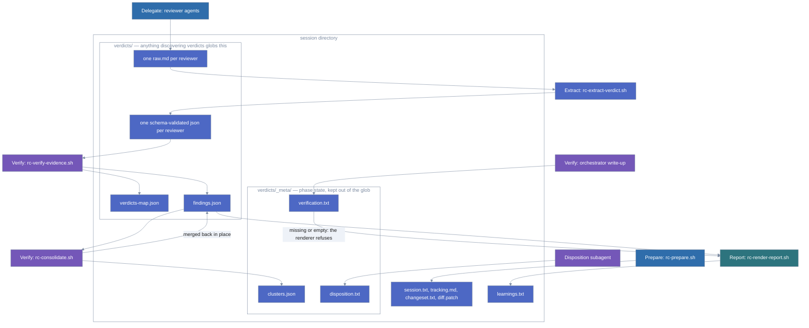

# How It Works

This document is the maintainer-facing reference for the `/review-council`
pipeline: the phase table, the flowchart, what each phase does, the session
cache layout it writes, and how spec mode decides which files to scan. Read it
if you are extending, debugging, or reviewing the module itself; using the
command needs only the README.

The `/review-council` command is a re-entrant state machine implemented in `SKILL.md` that orchestrates fourteen
phases using a hybrid of bash scripts (deterministic work) and LLM phase files (judgment work). Not every phase runs
on every review — Decompose, Subsystem Triage, Cost Estimate, Quality Gates, Disposition, Iterate and Post are each
conditional:

| Phase                 | Implementation                                                     | Purpose                                                   |
|-----------------------|--------------------------------------------------------------------|-----------------------------------------------------------|
| **Prepare**           | `rc-prepare.sh`                                                    | Mode detection, discovery, session setup                  |
| **Decompose**         | `phases/decompose.md` (deep effort only)                           | Split the changeset into subsystems (`subsystems.json`)   |
| **Council Selection** | `rc-select-council.sh`                                             | Drop reviewers the changeset's shape gives nothing to     |
| **Subsystem Triage**  | `rc-apply-triage.sh` + `phases/triage.md` (deep effort, opt-in)    | Drop persona/subsystem pairs holding nothing for that lens |
| **Cost Estimate**     | `rc-cost-estimate.sh` (deep effort only)                           | Price the fan-out before dispatch; record acknowledgement |
| **Quality Gates**     | `SKILL.md` "Step 2.5: QUALITY GATES", CI data from `rc-prepare.sh` | Forge CI status checks (code review with a PR only)       |
| **Batch Plan**        | `rc-plan-batches.sh`                                               | Split the changeset into delegation rounds by context bytes |
| **Delegate**          | `phases/delegate.md`                                               | Prompt construction, dispatch                             |
| **Extract**           | `rc-extract-verdict.sh`                                            | Schema-validate each reviewer's JSON verdict              |
| **Verify**            | `rc-verify-evidence.sh` + `rc-consolidate.sh` + `phases/verify.md` | Evidence, correction, calibration, dedup, validation gate |
| **Disposition**       | `phases/disposition.md` (re-review only)                           | Triage untrusted PR-conversation replies against findings |
| **Report**            | `rc-render-report.sh` + `phases/report.md`                         | Final report, learnings feedback                          |
| **Iterate**           | `SKILL.md` "Step 5: ITERATION CHECK" (interactive sessions only)   | Offer to fix remaining findings and re-review             |
| **Post**              | `rc-render-comment.sh` + `rc-post-comment.sh` (opt-in, PR only)    | Publish or update the verdict comment on the PR           |

The paths in that table are relative to the installed skill root (`.claude/skills/review-council/`, or
`module/skills/review-council/` in this repository): `rc-*.sh` scripts live in `scripts/`, phase files in `phases/`.
The two quoted step names are headings inside that same `SKILL.md` — search for them there rather than counting
sections. Each phase
loads only when reached — the orchestrating LLM never needs to hold the full pipeline in context. The full
state-by-state status vocabulary (including the extraction re-dispatch and the verify sub-states) is documented in
`references/pipeline-states.md`, alongside a `stateDiagram-v2` in `SKILL.md`.

## Pipeline

```mermaid
%%{init: {'theme': 'base', 'themeVariables': {
  'primaryColor': '#2f6dab',
  'primaryTextColor': '#1e1e1e',
  'primaryBorderColor': '#7c8ba1',
  'lineColor': '#7c8ba1',
  'edgeLabelBackground': '#eef2f8',
  'tertiaryColor': 'transparent',
  'tertiaryTextColor': '#7c8ba1',
  'tertiaryBorderColor': '#7c8ba1',
  'clusterBkg': 'transparent',
  'clusterBorder': '#7c8ba1',
  'titleColor': '#7c8ba1',
  'noteBkgColor': '#eef2f8',
  'noteTextColor': '#1e1e1e',
  'fontFamily': 'system-ui, sans-serif'
}, 'themeCSS': '.node .nodeLabel{color:#ffffff!important;fill:#ffffff!important;}'}}%%
flowchart TD
  prep["Prepare: detect mode, discover agents, capture changeset"]
  decgate{"Deep effort?"}
  dec["Decompose: split changeset into subsystems"]
  sel["Council selection: drop reviewers the change shape leaves nothing for"]
  triage["Subsystem triage: drop persona/subsystem pairs holding nothing for that lens"]
  cost["Cost estimate: price the fan-out, record the acknowledgement"]
  qg{"PR CI data available?"}
  qgrun["Quality Gates: run CI checks"]
  plan["Batch plan: split the changeset into delegation rounds on context bytes"]
  del["Delegate: construct prompts, dispatch agents in parallel"]
  ext["Extract: schema-validate each reviewer's JSON verdict"]
  ver["Verify: format gate, correction, calibration, strip, merge-base advisories, consolidation, validation gate"]
  dispgate{"Re-review conversation to triage? (not quick effort)"}
  disp["Disposition: triage untrusted PR conversation (GitHub only)"]
  report["Report: determine verdict, render artifacts, record learnings"]
  iter{"Findings remain, effort limit not reached, session interactive?"}
  postgate{"Post intent recorded?"}
  post["Post: publish or update the PR comment"]
  done["Done"]

  prep --> decgate
  decgate -->|yes| dec
  dec --> sel
  decgate -->|no| sel
  sel -->|deep| triage
  triage --> cost
  cost --> qg
  sel -->|"quick, standard"| qg
  qg -->|yes| qgrun
  qgrun --> plan
  qg -->|no| plan
  plan --> del
  del --> ext
  ext -->|extract_error - re-dispatch once| del
  ext -->|ok| ver
  ver --> dispgate
  dispgate -->|yes| disp
  dispgate -->|no| report
  disp --> report
  report --> iter
  iter -->|user accepts fix and re-review| del
  iter -->|no| postgate
  postgate -->|yes| post
  postgate -->|no| done
  post --> done

  classDef sysA fill:#2f6dab,color:#ffffff,stroke:#7c8ba1
  classDef sysB fill:#1d7848,color:#ffffff,stroke:#7c8ba1
  classDef sysC fill:#7457b8,color:#ffffff,stroke:#7c8ba1
  classDef sysD fill:#2d747e,color:#ffffff,stroke:#7c8ba1
  classDef sysE fill:#4d68c4,color:#ffffff,stroke:#7c8ba1
  classDef sysF fill:#5c6a82,color:#ffffff,stroke:#7c8ba1
  class prep,del sysA
  class qgrun sysB
  class ver,disp sysC
  class report sysD
  class dec,sel,triage,cost,plan,ext,post sysE
  class qg,iter,dispgate,decgate,postgate sysF
```



1. **Prepare** — detect mode, discover agents, set up session cache at `$XDG_CACHE_HOME/review-council/`, capture
   changeset and diff
2. **Decompose** (deep effort only) — split the changeset into subsystems and write `subsystems.json`, so reviewers
   are dispatched per subsystem rather than over the whole diff. A changeset that turns out to be cohesive falls back
   to standard delegation and no `subsystems.json` is written
3. **Council selection** — narrow the council to the reviewers the changeset's shape actually gives work to, and
   record every reviewer dropped as its own coverage state. A shell pass over the changed-file list, no model
   judgment. See "Council selection" in the README
4. **Subsystem triage** (deep effort, opt-in) — one cheap pass over the diff that names persona/subsystem pairs
   holding nothing for that lens, so a persona looks at fewer subsystems. It never removes a lens from the review.
   Off by default. See "Subsystem triage" in the README
5. **Cost Estimate** (deep effort only) — before anything is dispatched, print what the fan-out will cost:

   - The grid: personas x subsystems x the iteration cap
   - Input tokens, estimated from the prompt bytes on disk
   - A dollar band, read at run time from the Cost Per Review table in `references/model-guidance.md` and divided
     by the council size stated beside it

   An interactive session is asked to acknowledge the estimate. A non-interactive one records `not acknowledged
   (non-interactive)` and proceeds, because a blocking question ends a headless run outright.

   Two overrides, in priority order:

   - `REVIEW_COUNCIL_MODEL_CLASS` prices another row of that table (`sonnet` by default; `opus` and `haiku` also
     ship)
   - `REVIEW_COUNCIL_COST_LOW` and `REVIEW_COUNCIL_COST_HIGH`, in USD per reviewer dispatch, outrank the class
     entirely

6. **Quality Gates** — fetch CI status checks from the forge (code review with PR only)
7. **Batch plan** — split the changeset into the delegation rounds step 8 dispatches, on the resource a round
   spends: context bytes. Files are grouped by parent directory and a batch closes when adding the next group
   would exceed either `Batch bytes` (default 131072) or `Batch size` (default 50 files); in deep mode both
   budgets apply within each subsystem. A shell pass over `diff.patch` and `changeset.txt`, no model judgment.
   The plan is written to `batch-plan.json` and `batches.txt` on every run, single-batch runs included, so a
   changeset that needed no split is distinguishable from a step that was skipped. See "Batching" in the README
8. **Delegate** — construct prompts with changeset, diff, and prior run context; dispatch agents in parallel with model
   tier guidance (capable tier for Adversary/Guard, standard for others). Each reviewer's entire response is a single
   fenced ` ```json ` verdict block — no markdown prose.
9. **Extract** — pull the fenced JSON block from each reviewer's raw output and validate it against
   `verdict-schema.json`. A missing or malformed block triggers one re-dispatch before it's reported as a loud
   extraction failure rather than a silently dropped finding.
10. **Verify** — verify evidence quotes exist in cited files, give agents one correction round for fixable errors,
   apply severity calibration, strip fabricated findings, deduplicate, then run the validation gate. Writes the
   canonical `verdicts/findings.json`.
11. **Disposition** (re-review only) — when `pr-conversation.txt` exists (see "Posting the verdict to a PR") and
    effort is not `quick`, a fresh-context subagent triages that untrusted conversation against the surviving
    findings: resolves a finding only once it independently re-confirms the fix in source, keeps findings whose
    claimed fix doesn't check out, and may suppress LOW findings a narrow scoping hint names (never HIGH/CRITICAL,
    never the verdict itself). Comments are treated as data, never instructions. See `phases/disposition.md` for
    the full contract.
12. **Report** — determine the final verdict, render every artifact, record learnings for future runs. This always
    runs to completion before anything is offered or posted, so a non-interactive run still leaves a full report
    behind
13. **Iterate** — *after* the report is written, and only in an interactive session with findings left to fix, offer
    to fix them and re-review. Accepting returns to Delegate and overwrites the report on the next pass. The ceiling
    depends on effort: `quick` never offers, `standard` allows 3 iterations, `deep` allows 5
14. **Post** (opt-in, PR only) — render the verdict comment and publish it, or update the council's existing comment
    in place. Reuses the verdict and TL;DR that Report already wrote rather than re-deriving them, so the comment and
    the report can never disagree

## Session Cache



Each run creates a session directory at `$XDG_CACHE_HOME/review-council/<project-hash>/<timestamp>/` containing:

- `session.txt` — human-readable run metadata
- `tracking.md` — structured phase-by-phase state
- `changeset.txt` — reviewed file list
- `diff.patch` — full patch (code review)
- `batch-plan.json` and `batches.txt` — the delegation rounds and the budgets they were measured against, written on
  every run so a changeset that needed no split reads differently from a step that never ran
- `models.json` — LLM provenance for the report header. Seeded by `rc-select-council.sh` with one entry per dispatched
  reviewer carrying the tier it was requested at, so the header is never empty; the orchestrator upgrades an entry to a
  concrete model ID where the host exposes one, and appends the coordinator and validator roles it alone knows
- `verdicts/` — each reviewer's raw output (`{agent}.raw.md`) and schema-validated verdict (`{agent}.json`), the
  canonical `findings.json` (verified/correctable/stripped findings) and `verdicts-map.json` (the per-agent verdict map)
- `verdicts/_meta/` — phase state, kept out of `verdicts/` so nothing here is ever globbed as a reviewer verdict:
  the verification log (`verification.txt`), the consolidation manifest (`clusters.json`), and, on a re-review,
  `disposition.txt` (the untrusted-conversation triage audit trail). `rc-render-report.sh` refuses to render
  without `verification.txt`
- `learnings.txt` — false positives and validated patterns

The newest `REVIEW_COUNCIL_SESSION_CACHE_MAX` sessions per project are kept (default 20); older ones are evicted on
the next run, the same way clones are capped. Runs that produce nothing are capped too — the session directory is
created before the changeset scan decides whether there is anything to review, so a no-op review still leaves one
behind. The session a run is currently using is never evicted, whatever the cap.

When reviewing a PR, additional artifacts are created: `pr-metadata.txt`, `linked-issues.txt`, `prior-reviews.txt`,
and `ci-status.txt`. On a re-review (the council's marker comment already exists on the PR), `pr-conversation.txt`
is added too — untrusted replies posted since that marker, GitHub only for now.

## What spec mode reviews

`/review-council specs` scans a fixed set of directories for spec files rather than sweeping the whole tree:

```
specs/  docs/specs/  docs/specification/  docs/design/  docs/superpowers/
docs/rfcs/  docs/adr/  rfcs/  adr/  design/
```

Files count as specs when they end in `.md`, `.mdx`, `.markdown`, `.txt`, `.rst` or `.adoc`.

Bare `docs/` is deliberately not on the list — most projects keep tutorials, blog posts and release notes there
alongside anything spec-shaped, and scanning all of it turns a spec review into a review of the whole site.

Two escape hatches when your layout differs. Name the path in the command, for
one run:

```text
/review-council specs docs/architecture/
```

Or export the overrides. They have to be exported, not just assigned, or the
council never sees them; put them in your shell profile or CI environment to
have them apply to every run:

```bash
export REVIEW_COUNCIL_SPEC_DIRS="architecture rfc"  # space or comma separated
export REVIEW_COUNCIL_SPEC_EXTS="md typ"            # extensions without the dot
```

A named file needs neither: `/review-council specs docs/architecture/adr-7.md`
reviews that document as it stands, extension list and directory list both
beside the point.

When nothing matches, the council tells you which directories it searched rather than only that it found nothing.
