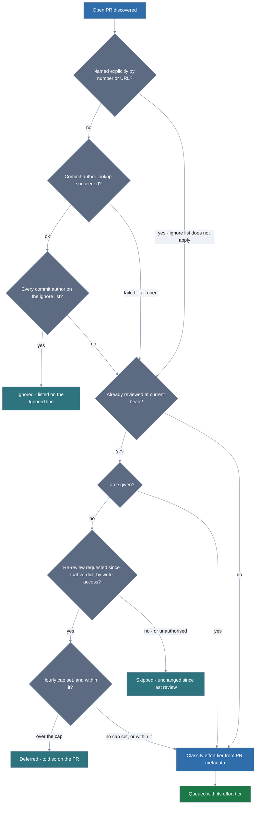

# How a PR reaches the queue

This document explains the gates `scripts/review-open-prs.sh` puts between an
open pull request and the review queue: the order they run in, how the two
overrides cross, and what the driver accepts as a prior verdict of its own.
Read it if you are changing the driver's queueing rules or reasoning about why
a particular PR was skipped; running a batch needs only
[Batch-reviewing every open PR](../batch-reviewing-prs.md).

Seven gates decide each PR's fate, and the two overrides cross rather than nest:
naming a PR by number or URL jumps the **ignore list** but still respects the
already-reviewed check, while `--force` jumps the **already-reviewed** check —
and the hourly cap behind it — but never rescues an ignored bot PR. So a named,
unchanged, already-reviewed PR needs `--force` as well. A failed authorship
lookup fails open — the PR carries on to the reviewed check rather than dropping
out.

A PR already reviewed at its head has one more way through: someone with write
access can comment `/review-council review` and ask for another look. That path
has a gate of its own — an hourly cap, set with `--requests-per-hour` or
`REREVIEW_PER_HOUR` and **off unless you set it** — because it is the one route
by which somebody other than you can spend the API budget. `--force` turns the
cap off again: under it every outstanding request is admitted, nothing is
deferred, and no decline reply is posted.

**Queue order.** PRs with no prior council comment go first, then PRs whose last
review was for an older commit, then PRs someone asked to have re-reviewed. A PR
in none of those groups is skipped; `--force` queues it anyway. All of it comes
from the marker the council embeds in every comment it posts — an HTML comment,
so it is hidden from the rendered thread but sits in the comment body in plain
sight (see "Posting the verdict to a PR" in the README). A failed lookup queues the PR
rather than skipping it, so a flaky API call costs you a redundant review
instead of a silently missed one.

**What counts as our verdict.** Hidden is not secret: anyone who quotes a
verdict or views its source has the marker, and anyone can type one. Three
things must hold
before a comment is treated as a prior review:

- the marker starts a **line**, at column 0. GitHub's "Quote reply" copies it
  behind a `> ` prefix, so a quoted verdict is not a verdict.
- the comment was **authored by the account `gh` is authenticated as**.
- the comment is **not collapsed**.

A marker posted by any other account is named in the plan output and the PR is
reviewed anyway. A token that rotated between runs and a forged marker look
identical from the timeline, and reviewing is the safe answer to both — the
worst a forgery achieves is a review that was going to happen regardless.
