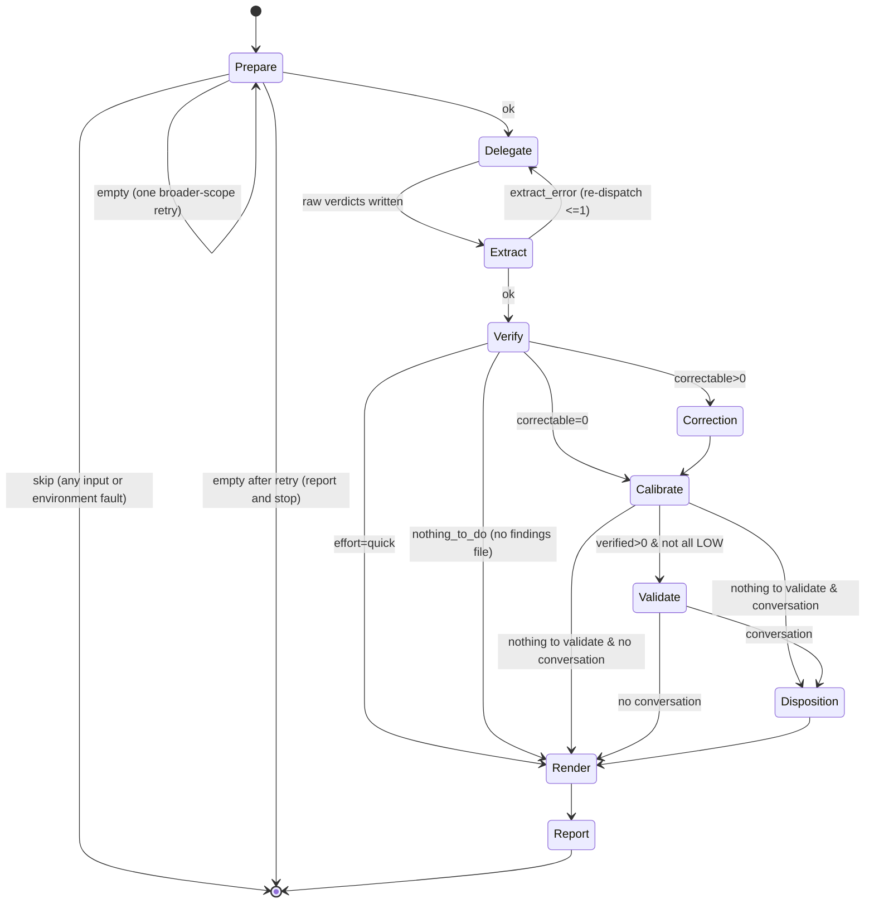

# Review Council

<HARD-GATE>
Review Council is READ-ONLY by default. After producing verdict, STOP
and present findings to user. Do NOT fix, edit, or modify any reviewed
code or spec unless user explicitly instructs you in current session.
Applies to ALL iterations, ALL severity levels, both code and spec
review modes. Write operations permitted without user consent: session bookkeeping
(tracking files, verdict files, learnings) inside session directory.

One external write is permitted, and ONLY under all of these conditions:
posting the council verdict as a PR comment (Step 7) when (a) the user's
request explicitly asked to post/comment, and (b) the exact rendered body was
shown and the user confirmed — or the user gave standing authorization to post
without asking. That permission covers ONLY comments the council itself
authored: the post script refuses to update or hide a comment written by anyone
else, even one carrying the council marker, since the marker is public and any
PR participant can post one. Cloning a target repo for review (Step 1) reads
source only and never executes cloned code. No other external writes, code
edits, or command execution are permitted.

Do NOT run local builds, tests, linters, or CI commands. Review Council
analyzes source code statically — never executes project code. Reading
upstream CI status from forge (Step 2.5) permitted; launching local
processes not.
</HARD-GATE>

<EXECUTION-CONTRACT>
Prepare, verify, report, and post are SCRIPT-OWNED and DETERMINISTIC. You MUST
run the named script for each step and use its output. You MUST NOT perform
these steps by hand, even in non-interactive / headless runs:

- Do NOT hand-create or hand-edit the session directory, `tracking.md`,
  `session.txt`, or `session-manifest.json`. Only `rc-prepare.sh` creates them;
  use the `session_dir` it returns in its JSON. `session-manifest.json` records
  the council that was actually dispatched, and `rc-verify-evidence.sh` diffs it
  against the verdicts that arrive to report `missing_verdicts` — editing it by
  hand makes a reviewer appear or disappear from the coverage the report claims.
- Write pipeline state that phases produce — `clusters.json`,
  `verification.txt`, `disposition.txt` — under `${session_dir}/verdicts/_meta/`,
  never in `verdicts/` itself. `verdicts/` holds per-agent verdict artifacts and
  the derived `findings.json`; everything that discovers verdicts globs it, and
  a phase artifact landing there gets parsed as a verdict (RC-4).
  `rc-prepare.sh` creates `_meta/` with the session, so it always exists.
- Do NOT clone the target repo yourself. `rc-prepare.sh` invokes
  `rc-clone-target.sh` and returns `review_root`; read changeset files there.
- Do NOT hand-write the report. Run `rc-render-report.sh`, then fill only the
  markers it leaves: `<!-- TLDR -->`, `<!-- SUBSYSTEM-ANALYSIS -->`,
  `<!-- MERGE-ADVISORIES -->`, `<!-- ACCEPTANCE-CRITERIA -->`,
  `<!-- DISPOSITION-OUTCOMES -->`, `<!-- CI-COMMENTARY -->`,
  `<!-- NARRATIVE -->`, `<!-- LEARNINGS -->`.
  Each is replaced by literal string substitution; when the phase that produces
  the section did not run, delete the marker line **and its trailing blank
  line** so the gap it leaves does not stack up. `<!-- TLDR -->` is the sole
  exception — every report has a TL;DR, so it is always filled, never deleted;
  when its source file is absent or empty, fill it with the fallback line
  rather than dropping it. No raw marker may survive into the rendered
  report. Never append a section the renderer did not anchor; a section you
  think is missing is a renderer bug, not something to hand-write.
- Do NOT hand-write the PR comment or invent a marker/verdict tag. The PR
  comment is rendered and posted ONLY by `rc-post-comment.sh`. Never build a
  comment body or a `gh api .../issues/comments` call yourself.

The scripts exist to remove LLM variance; re-implementing their work by hand is
a defect even when the output looks similar. Authored prose (TL;DR, narrative,
finding titles) uses plain ASCII punctuation only: no em or en dashes, no
arrows.
</EXECUTION-CONTRACT>

## Path Anchoring

Set `SKILL_DIR` to directory containing this file. Derive
`SCRIPTS_DIR`, `PHASES_DIR`, and `REFERENCES_DIR` from `SKILL_DIR` —
they ship inside the skill directory on every install layout:

```bash
SKILL_DIR=$(dirname "$(realpath "${BASH_SOURCE[0]}")")
SCRIPTS_DIR="${SKILL_DIR}/scripts"
PHASES_DIR="${SKILL_DIR}/phases"
REFERENCES_DIR="${SKILL_DIR}/references"
```

`AGENTS_DIR` is NOT assumed to be a sibling of `SKILL_DIR` — it
lives under the module root, not the skill directory. This holds on
both a co-located install (`.../module/skills/review-council` →
`.../module/agents`) and a split install (`~/.claude/skills/review-council/`
→ `~/.claude/agents`):

```bash
MODULE_DIR=$(dirname "$(dirname "${SKILL_DIR}")")
AGENTS_DIR="${MODULE_DIR}/agents"
```

All script and phase references below use these paths.
Construct full paths — never search by filename.

**When invoking scripts**, export as environment variables:

```bash
export AGENTS_DIR SCRIPTS_DIR PHASES_DIR REFERENCES_DIR
```

Scripts need `AGENTS_DIR` to discover reviewer agents. Pass when
calling `rc-prepare.sh`:

```bash
AGENTS_DIR="${AGENTS_DIR}" bash "${SCRIPTS_DIR}/rc-prepare.sh" [user args]
```

## Quick Reference

### Usage

```
/review-council              # auto-detect from current branch
/review-council code         # force code review mode
/review-council specs        # force spec review mode
/review-council 42           # review PR #42
/review-council main..feat   # review a ref range
/review-council https://github.com/org/repo/pull/42  # review by URL
/review-council HEAD         # review only the latest commit
/review-council module/      # review changes under a directory
/review-council everything   # explicit full-project review
/review-council code HEAD -> focus on security  # mode + target + instructions
```

### What It Does

Review Council dynamically discovers reviewer agents matching
`divisor-*-code.md` or `divisor-*-spec.md` (based on review mode),
delegates review to each persona in parallel, verifies findings
against actual file content, strips fabricated evidence, produces
council verdict (APPROVE or REQUEST CHANGES).

Five personas run in parallel: Guard (intent drift, governance,
structural coherence), Adversary (security, resilience), Tester
(test quality, coverage), Operator (deployment, dependencies),
Curator (documentation gaps).

## Pipeline (state machine)

The orchestrator is a status-dispatcher over stage scripts. Full status
vocabulary and transitions: `references/pipeline-states.md`.



## Execution Flow

Re-entrant state machine. If invoked mid-run, reads tracking file
and resumes from last completed phase.

### Step 0: INTERPRET INPUT (LLM judgment)

Before calling script, interpret user input and resolve to explicit
CLI flags. Script accepts only structured flags — does NOT parse raw
user input.

**Decision table:**

| User says                        | Flags                                                                                              |
|----------------------------------|----------------------------------------------------------------------------------------------------|
| *(empty)*                        | *(no flags — defaults apply)*                                                                      |
| `code`                           | `--mode code`                                                                                      |
| `specs`                          | `--mode specs`                                                                                     |
| `42`                             | `--scope pr --scope-value 42`                                                                      |
| `main..feat`                     | `--scope range --scope-value "main..feat"`                                                         |
| `HEAD`                           | `--scope range --scope-value "HEAD~1..HEAD"`                                                       |
| `v1.2.3`                         | `--scope range --scope-value "v1.2.3~1..v1.2.3"`                                                   |
| `module/`                        | `--scope changed --scope paths --scope-value "module/"`                                            |
| `everything`                     | `--scope all`                                                                                      |
| `https://...pull/42`             | `--scope url --scope-value "https://...pull/42"`                                                   |
| `code HEAD -> focus on security` | `--mode code --scope range --scope-value "HEAD~1..HEAD" --review-instructions "focus on security"` |
| `review the auth module`         | `--scope changed --scope paths --scope-value "src/auth/"`                                          |
| `do stuff and make it good`      | `--review-instructions "make it good"`                                                             |
| `quick`                          | `--effort quick`                                                                                   |
| `deep`                           | `--effort deep`                                                                                    |
| `quick code HEAD`                | `--effort quick --mode code --scope range --scope-value "HEAD~1..HEAD"`                            |
| `deep main..feat`                | `--effort deep --scope range --scope-value "main..feat"`                                           |
| `quick 42`                       | `--effort quick --scope pr --scope-value 42`                                                       |
| `42 and post the result`         | `--scope pr --scope-value 42 --post-comment`                                                       |
| `review PR 42, comment on it`    | `--scope pr --scope-value 42 --post-comment`                                                       |
| `42 post without asking`         | `--scope pr --scope-value 42 --post-auto-send`                                                     |

**Rules:**

1. **Scope** (what to review) vs **instructions** (how to review): separate them. *What files/commits* is scope. *What to look for* is instructions.
2. **Git refs** resolve to range: `REF` becomes `--scope range --scope-value "REF~1..REF"`. Ref ranges pass through: `X..Y` becomes `--scope range --scope-value "X..Y"`.
3. **Directory paths** become secondary filter: `--scope changed --scope paths --scope-value "dir/"`.
4. **Defaults**: scope unclear, omit `--scope` (code defaults to `changed`, specs to `all`). Mode unclear, omit `--mode` (auto-detect).
5. **Fallback**: input unclear on scope or mode, pass what you can, let defaults apply. Unrecognized text becomes `--review-instructions`.
6. **Effort** words: `quick` becomes `--effort quick`, `deep` becomes `--effort deep`. Neither present, omit `--effort` (defaults to `standard`). Effort words can appear anywhere alongside scope and mode tokens.
7. **No preemptive optimization**: First rc-prepare.sh call MUST use exactly flags from this table. Do not anticipate empty scope and skip to broader scope. Recovery table in Step 1 handles empty results — let it work.
8. **Posting** is opt-in and PR-only. Phrases like "post the result",
   "comment on the PR", "post the review" map to `--post-comment`. "Post
   without asking" / "auto-send" map to `--post-auto-send`. If the user asks
   to post but scope is not `pr`/`url`, do NOT add the flag — tell them there
   is no PR to post to.

### Step 1: PREPARE (scripted)

Run `${SCRIPTS_DIR}/rc-prepare.sh` with **exactly** flags from Step 0's
decision table. Do not add `--scope` if table omits it — script has own
defaults. Do not substitute broader scope expecting default will be empty.

```bash
AGENTS_DIR="${AGENTS_DIR}" bash "${SCRIPTS_DIR}/rc-prepare.sh" [resolved flags from Step 0]
```

Script creates session directory, captures changeset and diff, discovers
agents, detects forge/framework/language, fetches CI status, linked
issues, prior reviews (if PR), initializes tracking file.

**Review root / target materialization.** For `pr`/`url` scope on GitHub,
rc-prepare.sh materializes the PR head (via `rc-clone-target.sh`) when the
current working tree is not already that repo at that branch, and returns
`review_root` (the checkout path, or `.`). Reviewers and evidence verification
read files under `review_root` (see `delegate.md` "Review root" and pass
`REVIEW_ROOT` to `rc-verify-evidence.sh` in Step 4). When materialization is
skipped (non-GitHub forge, missing `gh` for a private repo, or clone failure),
`review_root` stays `.` and review proceeds from the diff — note this to the
user, since grounding is weaker.

**Returns JSON to stdout:**
```json
{
  "status": "ok | skip | empty",
  "message": "human-readable status or instruction",
  "session_dir": "/absolute/path/to/session",
  "mode": "code | specs",
  "agents": ["divisor-guard-code", "divisor-adversary-code", ...],
  "language": "Go",
  "framework": "none",
  "review_instructions": "",
  "scope_type": "changed | all | range | paths | pr | url",
  "scope_value": "",
  "scope_dir": "",
  "effort": "standard"
}
```

**If status is `skip`:** Read message field, report to user, stop.
Do not proceed to delegation.

**If status is `empty`:** Scope resolved to zero files. Try exactly
ONE recovery attempt using table below. If already retried once,
report empty result to user and ask what they want reviewed instead.

| Original scope                                      | Recovery action                                                                                                                                                                                       |
|-----------------------------------------------------|-------------------------------------------------------------------------------------------------------------------------------------------------------------------------------------------------------|
| `--scope changed` (with or without `--scope paths`) | Re-run with `--scope all` (keep `--scope paths` and `--scope-value` if present, keep `--mode`)                                                                                                        |
| `--scope range --scope-value "X..Y"`                | Re-run with `--scope changed` (keep `--mode`)                                                                                                                                                         |
| `--scope all`                                       | **Terminal — no retry permitted.** Output the message below verbatim (filling in the blanks), then end the task. Do not call rc-prepare.sh again. Do not read project files. Do not produce findings. |
| Any other                                           | Re-run with `--scope all` (keep `--mode`)                                                                                                                                                             |

When `--scope all` returns `empty`, output exactly this and stop:

> **Review Council: no files in scope.**
> Mode: {code or specs}
> Searched: {code: all tracked files. specs: quote the directory list out of rc-prepare.sh's own `empty` message verbatim — do not restate it from memory or from this file, because it is configurable per project via REVIEW_COUNCIL_SPEC_DIRS and a hand-copied list here has already gone stale once}
> Result: no matching files found.
>
> To continue, tell me which path or scope you'd like reviewed — for example:
> - `/review-council code` to review code instead of specs
> - `/review-council specs module/docs/` to review a specific directory

**Be explicit when changing scope.** Before re-running with recovery
flags, tell user what happened and what you try instead.
Example: "Diff for HEAD~1..HEAD contained no files. Falling back
to uncommitted and staged changes (--scope changed)."

Do NOT invent flags. Do NOT fall back to manual review. Run
rc-prepare.sh exactly once more with recovery flags. If second
attempt also returns `empty`, report both results to user and ask
what they want reviewed.

**If status is `ok`:** Capture session_dir, mode, effort, proceed to Step 2.

### Step 2: READ TRACKING (re-entry support)

Read `${session_dir}/tracking.md` (created by rc-prepare.sh).

Determine current state from tracking file:
- All phases complete and verdict recorded: report existing verdict, stop.
- Delegation or Verification in progress: resume from next incomplete phase.
- Starting fresh: proceed to Step 3.

Enables re-entry: if skill invoked mid-run, resumes without
repeating completed work.

### Step 2.1: DECOMPOSITION (deep mode only)

**Skip unless effort is `deep`.**

Read `${PHASES_DIR}/decompose.md` for decomposition instructions.

Analyze changeset from `${session_dir}/changeset.txt` and diff from
`${session_dir}/diff.patch`. Produce subsystem map, write to
`${session_dir}/subsystems.json`.

If decomposition produces single subsystem (changeset already cohesive),
fall back to standard-mode delegation — do not create `subsystems.json`.

**Update tracking:** Record subsystem count and names.

Proceed to Step 2.5 (Quality Gates).

### Step 2.5: QUALITY GATES (code review with PR only)

If `${session_dir}/ci-status.txt` exists (created by rc-prepare.sh for
PR-based code reviews with forge CI data):

**This step never blocks the review.** It used to present failing checks and
ask the user whether to carry on or give up, which is the same defect Step 5
carried one phase later: a run with nobody to answer — CI, a piped prompt, any
host without an interactive user — ends at the question having produced
nothing. The gate was
unreachable while the CI extractor was dropping every check run, and the first
headless review that reached a PR with red checks after that was fixed died
here.

Red CI is also the wrong thing to abort on. A failing pipeline is when a review
is most useful, and the reviewers are better for knowing which checks fail —
a test the changeset broke is a finding, not a reason to stop looking.

1. Read `${session_dir}/ci-status.txt`
2. If any check is graded `fail`, carry the check names and their conclusions
   into Step 3 as reviewer context, so a reviewer can connect a red check to
   the change that caused it. They also fill the report's `<!-- CI-COMMENTARY -->`
   marker.
3. Continue to Step 3 either way.

Abort only if the user has already asked you to stop on red CI, or says so
unprompted. Never solicit that answer here.

If `${session_dir}/ci-status.txt` does not exist, skip this step.

**Update tracking:** Set Phase: Quality Gates status to `complete`.

### Step 3: DELEGATION (iteration N)

**Read `${PHASES_DIR}/delegate.md`** for prompt construction
guidance and dispatch instructions.

**Before constructing prompts**, read session files:
- `${session_dir}/changeset.txt` — file list (scope-filtered)
- `${session_dir}/diff.patch` — diff (may be empty for `--scope all`)
- `${session_dir}/tracking.md` — scope, mode, language, framework metadata

<DISPATCH-ALLOWLIST>
Dispatch only the agent identifiers in the `agents` array `rc-prepare.sh`
returned in Step 1. That array is the sole source of truth for who reviews.
Do NOT dispatch a reviewer that is absent from it, even when a similarly
named agent is registered and dispatchable in the host — for example an
un-suffixed legacy `divisor-*` file (`divisor-guard`, not
`divisor-guard-code`) left in a host agents directory by an older install.
Those files are not discovered by `rc-prepare.sh` (it globs only
`divisor-*-code.md` / `divisor-*-spec.md`) and are stale; using them runs
unknown-version personas and yields a verdict you cannot trust. If Step 1
returned `skip` (or an empty `agents` array), dispatch NO reviewers: report
the skip message and stop, never a hand-picked substitute from the host.
</DISPATCH-ALLOWLIST>

For each reviewer agent in agents array from Step 1:
- Construct prompt using changeset from `changeset.txt`, diff from
  `diff.patch`, convention packs from `${REFERENCES_DIR}`, project
  configuration
- Dispatch agent using agent filename as identifier
  (e.g., "divisor-guard-code") — mechanism varies by host;
  see `${PHASES_DIR}/delegate.md` Dispatch Mechanism section
- Collect the agent's raw output verbatim, write to
  `${session_dir}/verdicts/{agent-name}.raw.md`

Dispatch all agents in parallel for speed.

**Extract and validate verdicts.** Once all raw output is collected, run:

`bash ${SCRIPTS_DIR}/rc-extract-verdict.sh ${session_dir}`

This extracts each agent's fenced ```json block from its `.raw.md` file,
schema-validates it against `${REFERENCES_DIR}/verdict-schema.json`, and
writes `${session_dir}/verdicts/{agent-name}.json` on success.

- `status: "ok"` — proceed to Step 4.
- `status: "extract_error"` — one or more agents emitted no parseable JSON
  block (a silent drop otherwise). Re-dispatch each listed agent ONCE per
  `${PHASES_DIR}/delegate.md` **Verdict Collection**, then re-run the
  script. If an agent still fails after that one attempt, log it loudly
  and surface it in the report — never a silent zero.
- `status: "nothing_to_do"` — zero verdict blocks were produced
  session-wide (a delegation failure, not a per-agent "no findings"
  signal). Stop and report a configuration issue.

**Effort-conditional behavior:**
- **quick / standard**: Delegate once over whole changeset as above.
- **deep**: If `${session_dir}/subsystems.json` exists, run one
  delegation round per subsystem. For each subsystem, scope changeset
  and diff to that subsystem's files. Write raw output to
  `${session_dir}/verdicts/{subsystem-name}/{agent-name}.raw.md`.
  Dispatch all agents for given subsystem in parallel, then next
  subsystem. Run `rc-extract-verdict.sh` once after all subsystems
  complete.

**Update tracking:** Set Delegation (iteration N) status to `complete`,
record agents dispatched, verdicts received, any failures.

Proceed to Step 4.

### Step 4: VERIFICATION (iteration N)

**First, run the evidence check.** Read `Review root:` from
`${session_dir}/tracking.md`. If it is `.`, run:

`bash ${SCRIPTS_DIR}/rc-verify-evidence.sh ${session_dir}`

If it is a path (materialized checkout), pass it so on-disk checks resolve:

`REVIEW_ROOT="<review_root>" bash ${SCRIPTS_DIR}/rc-verify-evidence.sh ${session_dir}`

Script consumes `verdicts/{agent-name}.json` (written in Step 3 by
`rc-extract-verdict.sh`), checks file existence, review-root containment,
contiguous-quote matching, line accuracy ±5, and cross-agent
deduplication. It writes the canonical `${session_dir}/verdicts/findings.json` (the full
verified/correctable/stripped finding objects, plus the per-agent verdict
map) and prints a summary to stdout.

**Returns JSON to stdout:**
```json
{
  "status": "ok | nothing_to_do",
  "message": "Evidence verification complete. 3 verified, 1 correctable, 0 stripped.",
  "verified": 3,
  "correctable": 1,
  "stripped": 0
}
```

**Branch on `status` before reading any file:**

- `status: "nothing_to_do"` — the script exited before writing
  `findings.json`, so this run produced no findings file at all.
  - Do NOT read `${session_dir}/verdicts/findings.json`. A stale copy from an
    earlier iteration may still be on disk, and reading it would present a
    previous run's findings as this one's.
  - Not reading it is not enough. `rc-render-report.sh` opens that path
    itself, for both the findings list and the per-agent verdict table, so
    **rename `${session_dir}/verdicts/findings.json` to
    `${session_dir}/verdicts/findings.json.stale`** before Step 6 runs.
    Renaming inside the session directory is session bookkeeping, permitted
    by the hard gate; the rename preserves the audit trail while making the
    file invisible to the renderer. Nothing to do if the path does not exist.
  - Write the abbreviated verification record to
    `${session_dir}/verdicts/_meta/verification.txt` — its shape is in
    `${PHASES_DIR}/verify.md`, under the `nothing_to_do` heading. Step 6's
    Pre-condition Gate refuses to render a report without that file and grants
    this status no exemption, so skipping it deadlocks the run: the gate sends
    the orchestrator back to Step 4, and Step 4 returns `nothing_to_do` again.
    That record is verify.md's Step 5, not this document's — the two numbering
    schemes collide at 5, and the next bullet skips the other one.
  - Skip Step 4.5 and this document's Step 5 (Iteration Check) and go to
    Step 6, which now finds no findings file and renders a report with zero
    findings. Step 4.5's own gate also excludes this status, so the skip is a
    shortcut, not a divergence.
  - Record the status in tracking, and relay the script's `message` verbatim
    — it names the input that was missing (session directory, `verdicts/`
    directory, agent verdict JSON, or review root), which is what an operator
    needs to fix it.
- `status: "ok"` — `findings.json` was written. Read
  `${session_dir}/verdicts/findings.json` for the full finding objects behind
  these counts; the stdout summary above carries counts only. Continue with
  the rest of this step.

**Everything below is the `ok` path.** The `nothing_to_do` arm has already
left Step 4 for Step 6 — do not fall through into what follows.

**Then, read `${PHASES_DIR}/verify.md`** for severity calibration,
cross-agent consolidation, and validation gate procedures. Run these in
this order:

- Apply severity calibration (LLM judgment on findings severity)
- **Consolidate cross-agent duplicates (verify.md Step 3c) — SCRIPT-OWNED,
  you MUST run it (standard and deep only).** When 2+ verified findings
  share a file, judge which describe the same underlying defect, write
  `${session_dir}/verdicts/_meta/clusters.json` (a members-only manifest per
  `${REFERENCES_DIR}/consolidation-schema.json`), then run:
  `bash ${SCRIPTS_DIR}/rc-consolidate.sh ${session_dir}`
  It folds each cluster into one primary finding and is a safe no-op when
  nothing qualifies. Run it **before** the validation gate so the validator
  sees the consolidated set.
  On `status: "consolidate_error"` the fold would have removed more findings
  than it declared merged, so it was refused and `findings.json` is unchanged.
  Stop the review and report the message verbatim. Do not re-run it and do not
  proceed to the validation gate: the manifest is not what failed, so rewriting
  it changes nothing, and every later stage reads the same document.
- Run validation gate — dispatch fresh-context validator agent
  to check findings against actual code
- Determine iteration verdict: APPROVE or REQUEST CHANGES

**Effort-conditional behavior:**
- **quick**: Skip correction round, severity calibration, cross-agent
  consolidation, validation gate. Run only `rc-verify-evidence.sh`
  (mechanical evidence check).
  Proceed directly to Step 5, skipping Step 4.5 (Disposition) — its own
  gate also excludes `quick`, so this is a shortcut, not a divergence.
- **standard**: Full verification as above.
- **deep**: Run Steps 1-3 of verify.md per-subsystem (iterate over
  subdirectories in `${session_dir}/verdicts/`). Then run validation
  gate once over aggregated findings from all subsystems, providing
  subsystem map from `${session_dir}/subsystems.json` as context.

**Update tracking:** Set Verification (iteration N) status to `complete`,
record findings total/verified/corrected/stripped, duplicates
consolidated, iteration verdict.

Proceed to Step 4.5 (Disposition).

### Step 4.5: DISPOSITION (re-review only)

**Skip entirely unless `${session_dir}/pr-conversation.txt` exists AND
effort is not `quick` AND the evidence check returned `ok`.** The last
condition is not redundant with Step 4's skip: this phase edits
`findings.json`, and on `nothing_to_do` this run wrote no such file — the
only thing that could be at that path is the stale copy Step 4 renamed
aside. This is the phase that reads the PR conversation
thread — attacker-controlled input by construction — and lets verified
claims about it change finding disposition. It exists
only for re-reviews; a first-time review has no prior verdict to have drawn
replies.

**Read `${PHASES_DIR}/disposition.md`** for the full procedure. Dispatch a
single fresh-context subagent (has not seen prior review phases) using **the
verbatim prompt from `disposition.md`'s "Step 3 — Subagent Prompt" section —
copy it exactly, do not paraphrase or summarize it.** The subagent's own file
access is the target repo, never this skill's `phases/` directory, so it can
only ever see the untrusted-data handling, the four rules, the
inconclusive-evidence fallback ("never mark a finding `resolved` on
inconclusive evidence"), and the output shape if they are inside that literal
prompt text — restating them here, paraphrased, would not reach the
subagent and would silently weaken the security posture this phase exists
for.

Append the untrusted contents of `${session_dir}/pr-conversation.txt` after
the prompt, then the findings to disposition, per `disposition.md` Step 2
("Inputs the subagent receives"). Agent profile (read-only over the review
root, plus narrowly-scoped structured edits to `findings.json`'s provenance
fields only, minimum temperature if supported) is also specified there —
Step 2 is orchestrator-facing setup, not part of the prompt text itself.

After the subagent returns:

- Resolved findings move from `verified` to `stripped` in `findings.json`
  (reason `DISPOSITION_RESOLVED`); agents left with zero remaining verified
  findings are upgraded to `APPROVE` per `verify.md` Step 6's logic. Only
  `resolved` removals count toward that check — `suppressed-low` removals are
  verdict-neutral and do NOT (`disposition.md` Step 4).
- Write `${session_dir}/verdicts/_meta/disposition.txt` as the audit trail
  (`disposition.md` Step 5).

**Update tracking:** Append `## Phase: Disposition` with gate result,
comments processed, resolved/kept/suppressed counts, verdicts upgraded.

Proceed to Step 5.

### Step 5: ITERATION CHECK

**This step never blocks the report.** Proceed to Step 6 now, whatever the
verdict, and run it to completion. The offer to fix and re-review comes
afterwards.

This ordering is the fix for a real loss. The offer used to sit here, between
verification and the report, and a run with nobody to answer it — CI, a piped
prompt, any host without an interactive user — simply ended at the question.
That leaves a session holding verified findings and a verdict recorded in
`tracking.md`, and no `report.md`, `verdict.txt` or `comment-summary.md` at all:
the entire point of the run, discarded at the last step. It was also
intermittent, because a run that happened to render before asking kept
everything, which is worse than a reliable failure.

- **Iteration limits by effort level** — these bound the offer below, and a
  limit already reached means no offer is made:
  - **quick**: Max 1 iteration. Never offer; the run ends after Step 6.
  - **standard**: Max 3 iterations. At iteration >= 3, warn this is iteration N
    and ask the user to confirm before continuing.
  - **deep**: Max 5 iterations. At iteration >= 3, warn as above.

**After Step 6 has written every artifact**, and only when all of the following
hold — at least one agent returned REQUEST CHANGES, the iteration limit is not
reached, and the session is interactive — present the verified findings and ask:
"Would you like me to fix these issues and re-review?"

- **User says yes:** Fix findings, increment the iteration counter, and return
  to Step 3 (Delegation). The next pass re-runs Step 6 and overwrites the
  artifacts, so the report always describes the latest iteration.
- **User says no, or the session is non-interactive, or no answer comes:** the
  run is already complete. The Step 6 artifacts stand as the outcome.

### Step 6: REPORT

**First, determine the council verdict** (`APPROVE`, `REQUEST CHANGES`, or
`APPROVE WITH ADVISORIES`) per the "Final Verdict Determination" rules in
`${PHASES_DIR}/report.md`, and write it as the first line of
`${session_dir}/verdict.txt`. The finding set is final for this iteration by the
time you get here — an accepted offer at the end of Step 5 returns to Step 3 and
runs this step again, overwriting it. Both the report renderer and the
PR-comment renderer read this one file, so the report and the posted comment can
never disagree about the outcome.

**Then run `${SCRIPTS_DIR}/rc-render-report.sh ${session_dir}` and
save its stdout to `${session_dir}/report.md`.** The script renders
structured report template (tables, counts, findings list, verdict)
from tracking and verification data, and leaves the eight markers named
in the EXECUTION-CONTRACT for the next step to fill or delete — see
`${PHASES_DIR}/report.md`, "How Sections Reach the Report", for which
procedure owns each one. If `verdict.txt` is missing or empty the
Council Verdict section renders as "not recorded" rather than guessing —
treat that in a rendered report as a bug in this step, not a council outcome.

**Then, read `${PHASES_DIR}/report.md`** for narrative synthesis
and learnings extraction guidance.

- Dispatch a prose subagent with **only**
  `${session_dir}/verdicts/findings.json` as input. It returns a
  one-line TL;DR and a 2-4 paragraph narrative — nothing else, no
  structure. Write the TL;DR to `${session_dir}/comment-summary.md`
  and the narrative to `${session_dir}/narrative.md`.
- Splice deterministically: replace the single `<!-- NARRATIVE -->`
  line in `${session_dir}/report.md` with the verbatim contents of
  `${session_dir}/narrative.md`, and the single `<!-- TLDR -->` line
  with the verbatim contents of `${session_dir}/comment-summary.md`.
  This is a plain string substitution performed by the orchestrator,
  not the model free-forming the report.
- Whenever `${session_dir}/comment-summary.md` is absent or empty —
  in any effort mode, whether the subagent was skipped or dispatched
  and failed — fill `<!-- TLDR -->` with the literal line
  `Automated review complete.` instead. Never delete it: the TL;DR
  marker is the one marker that is not conditional on a phase running.
- Extract learnings from review (patterns, anti-patterns, gaps)
- Record learnings using Knowledge tool (if configured) or
  write to `${session_dir}/learnings.txt`
- Splice the `<!-- LEARNINGS -->` marker: same mechanism as the NARRATIVE
  splice above — replace the single `<!-- LEARNINGS -->` line in
  `${session_dir}/report.md` with the learnings summary just recorded
  (the verbatim contents of `${session_dir}/learnings.txt`, or a short
  summary of what was stored when a Knowledge tool is configured instead)
- Output final report with council verdict

**Effort-conditional behavior:**
- **quick**: Compact report: findings list (sorted by severity)
  and verdict only. Skip learnings extraction and narrative synthesis
  (no subagent dispatch, no narrative splice). Still splice the
  `<!-- LEARNINGS -->` marker — replace it with the literal line
  `None recorded.` — and the `<!-- TLDR -->` marker, which takes the
  absent-or-empty fallback above because no subagent wrote
  `comment-summary.md`. No raw HTML-comment marker may survive into
  the rendered report.
- **standard**: Full report as above.
- **deep**: Full report, and the `<!-- SUBSYSTEM-ANALYSIS -->` marker
  (which the renderer leaves immediately before the findings list) is
  filled rather than emptied. Read `${session_dir}/subsystems.json`,
  build the tree with finding counts per subsystem, and substitute it
  for the marker line. Include learnings.

**Update tracking:** Set Report status to `complete`, record council
verdict and learnings count.

### Step 7: POST (opt-in, terminal)

**Skip entirely unless post intent was recorded.** Read `Post intent:` from
`${session_dir}/tracking.md` (set by rc-prepare.sh from `--post-comment` /
`--post-auto-send`). If `no`, stop after Step 6.

Posting requires a PR target. If there is no PR (`PR: none`), tell the user
there is nothing to post to and stop.

1. **Reuse the recorded verdict.** Step 6 is the sole owner of
   `${session_dir}/verdict.txt` — do NOT re-derive or rewrite it here.
   `rc-render-comment.sh` reads its first line. Rewriting it at post time is
   how the posted comment and the rendered report drift apart.

2. **Reuse the existing TL;DR.** Step 6's prose subagent is the sole owner of
   `${session_dir}/comment-summary.md` — do NOT write or regenerate it here.
   `rc-post-comment.sh` reads it via `rc-render-comment.sh` (`head -n1
   comment-summary.md`). If effort was `quick` (Step 6's narrative synthesis
   skipped, so the file may not exist), do nothing: the renderer falls back to
   a generic TL;DR ("Automated review complete.") when the file is absent.

3. **Render (dry-run)**:

   `bash ${SCRIPTS_DIR}/rc-post-comment.sh ${session_dir}`

   Read the rendered `${session_dir}/comment-body.md` and show it to the user.

   The result carries `parts`, `pare_level` and `findings_dropped`. When
   `parts` is greater than 1 the verdict did not fit one comment and was
   split: `part_files` lists every file, in order, and the user must be shown
   that there are several — not just the first. When `pare_level` is greater
   than 0 the body was trimmed to fit; say so, and say that the full verdict
   is in the report and the run artifacts. Do NOT present a trimmed body as
   the complete review.

4. **Confirm and send**:
   - Read `Post auto-send:` from tracking.md.
   - If `no`: ask the user — "Post this comment to PR #{N} on {forge}?" Only on
     an affirmative answer, send.
   - If `yes` (standing authorization): send without asking.
   - Send by setting the authorization env var **only for this command**:

     `REVIEW_COUNCIL_ALLOW_POST=1 bash ${SCRIPTS_DIR}/rc-post-comment.sh ${session_dir} --send`

     `REVIEW_COUNCIL_ALLOW_POST=1` is a hard, machine-checkable gate: the script
     refuses to post without it (returning `status: confirm_required`), so a
     prose slip can never post silently. Set it ONLY after an affirmative
     confirmation or standing auto-send — never pre-emptively, never exported
     for the whole session.
   - If the script returns `status: rendered` with a "post manually" message
     (`gh` absent or unsupported forge), relay the body and instruction to the
     user instead of claiming it was posted.
   - If it returns `status: error` (the forge query, create, or update failed),
     tell the user the post did NOT succeed and why — never report a comment as
     created/updated when the script reported an error.
   - The action may be `created`, `updated`, or `unchanged` (same commit,
     nothing changed); a `created` on a new commit also supersedes and hides the
     prior commit's comment, every part of it. Relay the action and `superseded`
     count faithfully. On a chained verdict the action summarises the whole
     chain, with per-part `created`/`updated`/`unchanged` counts alongside it.

5. **Report the outcome**: state whether the comment was created, updated, or
   left for manual posting — and, when the verdict was split or trimmed, say
   that too.

**Update tracking:** Append a `## Phase: Post` section recording intent,
whether sent, and the action (created/updated/manual).

---

## Tracking File Template

Maintain `${session_dir}/tracking.md` throughout run. Update after
each phase completes. Preparation and Quality Gates phases written
by `rc-prepare.sh`. Orchestrator writes subsequent phases.

```markdown
# Review Council Session Tracking

## Phase: Preparation

- Input type: {auto | pr_number | ref_range | url | dir_scope | all}
- Scope: {changed | all | range | paths | pr | url}
- Scope value: {resolved scope value or base...HEAD}
- Forge: {github | gitlab | local}
- Tooling: {gh | glab | none}
- PR: {none | PR number}
- Linked issues: {count}
- Prior reviews: {count}
- Constitution: {none | path (source)}
- Mode: {code | spec} ({reason})
- Effort: {quick | standard | deep}
- Branch: {branch name}
- Base: {main | master}
- Language: {language}
- Framework: {framework | none}
- Review root: {. | path}
- Post intent: {yes | no}
- Post auto-send: {yes | no}
- Agents discovered: {count}
- Agents absent: none
- Changeset size: {count} files

## Phase: Decomposition (deep mode only)

- Subsystems: {count}
- Names: {comma-separated}
- Cross-cutting files: {count}
- Fallback to standard: {yes|no}

## Phase: Quality Gates

- Forge CI: {available | unavailable}
- Forge CI failures: {count}

## Phase: Delegation (iteration {N})

- Status: {pending | complete | failed}
- Agents dispatched: {count}
- Verdicts received: {count}
- Agent failures: {list or "none"}

## Phase: Verification (iteration {N})

- Status: {pending | complete | failed}
- Findings total: {count}
- Findings verified: {count}
- Findings correctable: {count}
- Findings stripped: {count}
- Duplicates consolidated: {count}
- Verdict: {APPROVE | REQUEST CHANGES}

## Phase: Disposition (re-review only)

- Gate: {skipped (no conversation) | skipped (quick effort) | ran}
- Comments processed: {count}
- Findings resolved: {count}
- Findings kept: {count}
- Findings suppressed (LOW): {count}
- Verdicts upgraded: {count}

## Phase: Report

- Status: {pending | complete}
- Council verdict: {APPROVE | REQUEST CHANGES | APPROVE WITH ADVISORIES}
- Learnings recorded: {count}

## Phase: Post

- Intent: {yes | no}
- Sent: {yes | no | manual}
- Action: {created | updated | manual | none}
```

---

## Extension Points

Configure optional integrations in project's AGENTS.md or CLAUDE.md:

```text
## Review Council Configuration

- Constitution: ./path/to/governance.md
- Knowledge tool: my_semantic_search
- Docs repo: myorg/docs
- Quality tool: my_quality_reporter
- Max comments: 1
- Comment limit: 65536
```

All extension points optional, degrade gracefully when omitted.
No Constitution path configured: constitution-specific checks skipped.

`Max comments` and `Comment limit` govern an oversized verdict. A review
with enough findings renders a comment the forge rejects: GitHub caps an
issue comment at 65,536 characters and a 30-finding review reaches about
58,000. `Max comments` (default 1) is how many comments one verdict may
be spread across; `Comment limit` overrides the forge's own value, and is
only needed when the effective limit is smaller — self-hosted GitLab, or
GHE behind a proxy. Beyond `Comment limit` x `Max comments` the renderer
trims, analysis prose before evidence and CRITICAL last, and says so in a
line beginning `Trimmed to fit the`. The full verdict is always in the
run artifacts. See README "Oversized verdicts".

Convention packs define project-specific coding standards. Override or
extend shipped packs by placing files in `.review-council/packs/`
or `$XDG_CONFIG_HOME/review-council/packs/`.
